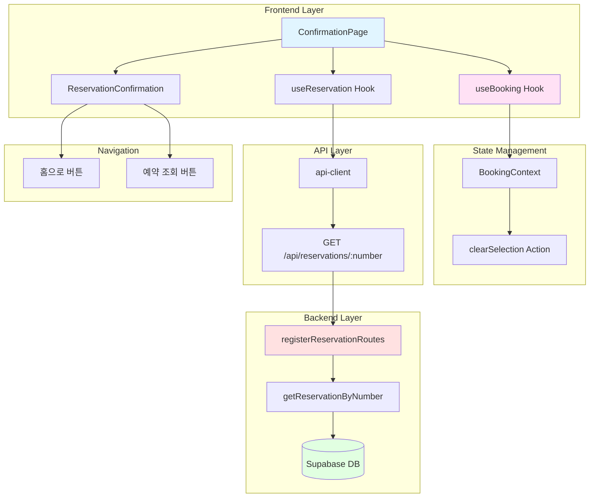

# Implementation Plan: 예약 완료 페이지

## 개요

예약 완료 페이지(`/concerts/[id]/confirmation`)를 구현하기 위한 모듈 설계

### 모듈 목록

| 모듈명 | 위치 | 설명 |
|--------|------|------|
| **Frontend** |
| ConfirmationPage | `src/app/concerts/[id]/confirmation/page.tsx` | 예약 완료 페이지 |
| ReservationConfirmation | `src/features/reservation/components/reservation-confirmation.tsx` | 예약 확인 정보 표시 |
| useReservation | `src/features/reservation/hooks/use-reservation.ts` | 예약 조회 React Query 훅 |
| **Backend** |
| getReservationByNumber | `src/features/reservation/backend/service.ts` | 예약 조회 서비스 (추가) |
| ReservationParamsSchema | `src/features/reservation/backend/schema.ts` | 파라미터 스키마 (추가) |
| **Shared** |
| formatConcertDate | `src/lib/utils.ts` | 날짜 포맷 (재사용) |
| formatPrice | `src/lib/utils.ts` | 가격 포맷 (재사용) |

---

## Diagram



---

## Implementation Plan

### 1. Backend Implementation

#### 1.1 Schema Additions
**파일**: `src/features/reservation/backend/schema.ts`

기존 파일에 추가:
```typescript
export const ReservationParamsSchema = z.object({
  number: z.string().min(1, 'Reservation number is required'),
});

export type ReservationParams = z.infer<typeof ReservationParamsSchema>;
```

**충돌 여부**: ✅ 기존 파일 확장, 충돌 없음

#### 1.2 Service Layer Addition
**파일**: `src/features/reservation/backend/service.ts`

기존 파일에 추가:
```typescript
export async function getReservationByNumber(
  supabase: SupabaseClient,
  reservationNumber: string
): Promise<Result<ReservationResponse, ReservationServiceError>> {
  try {
    const { data, error } = await supabase
      .from('reservations')
      .select(`
        reservation_number,
        customer_name,
        phone_number,
        total_amount,
        created_at,
        concerts!inner(
          name,
          date,
          venues!inner(name)
        ),
        reservation_seats!inner(
          seats!inner(section, row, column, grade)
        )
      `)
      .eq('reservation_number', reservationNumber)
      .eq('status', 'CONFIRMED')
      .single();

    if (error || !data) {
      return failure(404, reservationErrorCodes.notFound, 'Reservation not found');
    }

    const response: ReservationResponse = {
      reservation_number: data.reservation_number,
      customer_name: data.customer_name,
      phone_number: data.phone_number,
      total_amount: data.total_amount,
      created_at: data.created_at,
      concert: {
        name: data.concerts.name,
        date: data.concerts.date,
        venue_name: data.concerts.venues.name,
      },
      seats: data.reservation_seats.map((rs) => ({
        section: rs.seats.section,
        row: rs.seats.row,
        column: rs.seats.column,
        grade: rs.seats.grade,
      })),
    };

    return success(response);
  } catch (err) {
    return failure(
      500,
      reservationErrorCodes.fetchError,
      err instanceof Error ? err.message : 'Unknown error'
    );
  }
}
```

**충돌 여부**: ✅ 기존 파일에 함수 추가, 충돌 없음

**Unit Test**:
```typescript
describe('getReservationByNumber', () => {
  it('should return reservation by number', async () => {
    const result = await getReservationByNumber(mockSupabase, 'R12345678');
    expect(result.ok).toBe(true);
    if (result.ok) {
      expect(result.data.reservation_number).toBe('R12345678');
      expect(result.data.seats).toBeInstanceOf(Array);
    }
  });

  it('should return 404 for non-existent reservation', async () => {
    const result = await getReservationByNumber(mockSupabase, 'INVALID');
    expect(result.ok).toBe(false);
    if (!result.ok) {
      expect(result.error.code).toBe(reservationErrorCodes.notFound);
      expect(result.status).toBe(404);
    }
  });

  it('should not return cancelled reservations', async () => {
    const result = await getReservationByNumber(mockSupabase, 'CANCELLED123');
    expect(result.ok).toBe(false);
  });
});
```

#### 1.3 Route Handler Addition
**파일**: `src/features/reservation/backend/route.ts`

기존 파일에 추가:
```typescript
import { ReservationParamsSchema } from './schema';
import { getReservationByNumber } from './service';

// registerReservationRoutes 함수 내에 추가
app.get('/reservations/:number', async (c) => {
  const parsedParams = ReservationParamsSchema.safeParse({
    number: c.req.param('number'),
  });

  if (!parsedParams.success) {
    return respond(
      c,
      failure(
        400,
        reservationErrorCodes.invalidParams,
        'Invalid reservation number',
        parsedParams.error.format()
      )
    );
  }

  const supabase = getSupabase(c);
  const logger = getLogger(c);

  const result = await getReservationByNumber(
    supabase,
    parsedParams.data.number
  );

  if (!result.ok) {
    logger.error('Failed to fetch reservation', result.error.message);
  }

  return respond(c, result);
});
```

**충돌 여부**: ✅ 기존 라우터에 엔드포인트 추가, 충돌 없음

---

### 2. Frontend Implementation

#### 2.1 React Query Hook
**파일**: `src/features/reservation/hooks/use-reservation.ts`

```typescript
import { useQuery } from '@tanstack/react-query';
import { apiClient } from '@/lib/remote/api-client';
import type { ReservationResponse } from '../lib/dto';

export function useReservation(reservationNumber: string | null) {
  return useQuery({
    queryKey: ['reservation', reservationNumber],
    queryFn: async () => {
      if (!reservationNumber) {
        throw new Error('Reservation number is required');
      }
      const response = await apiClient.get<ReservationResponse>(
        `/api/reservations/${reservationNumber}`
      );
      return response.data;
    },
    enabled: !!reservationNumber,
    staleTime: Infinity, // 예약 정보는 변경되지 않으므로 무한 캐싱
  });
}
```

**충돌 여부**: ✅ 신규 훅, 충돌 없음

#### 2.2 ReservationConfirmation Component
**파일**: `src/features/reservation/components/reservation-confirmation.tsx`

```typescript
'use client';

import { useRouter } from 'next/navigation';
import { CheckCircle, Calendar, MapPin, User, Phone, CreditCard } from 'lucide-react';
import { Button } from '@/components/ui/button';
import { Card, CardContent, CardHeader, CardTitle } from '@/components/ui/card';
import { Separator } from '@/components/ui/separator';
import { Badge } from '@/components/ui/badge';
import { formatConcertDate, formatPrice } from '@/lib/utils';
import type { ReservationResponse } from '../lib/dto';

interface ReservationConfirmationProps {
  reservation: ReservationResponse;
}

const gradeLabels = {
  SPECIAL: 'Special',
  PREMIUM: 'Premium',
  ADVANCED: 'Advanced',
  REGULAR: 'Regular',
};

export function ReservationConfirmation({ reservation }: ReservationConfirmationProps) {
  const router = useRouter();

  return (
    <div className="space-y-6">
      {/* 예약 완료 메시지 */}
      <Card>
        <CardContent className="pt-6">
          <div className="flex flex-col items-center text-center space-y-3">
            <CheckCircle className="w-16 h-16 text-green-500" />
            <h2 className="text-2xl font-bold">예약이 완료되었습니다!</h2>
            <p className="text-muted-foreground">
              예약 번호를 꼭 기억해주세요.
            </p>
          </div>
        </CardContent>
      </Card>

      {/* 예약 번호 */}
      <Card>
        <CardContent className="pt-6">
          <div className="text-center">
            <p className="text-sm text-muted-foreground mb-2">예약 번호</p>
            <p className="text-3xl font-bold text-primary tracking-wider">
              {reservation.reservation_number}
            </p>
          </div>
        </CardContent>
      </Card>

      {/* 콘서트 정보 */}
      <Card>
        <CardHeader>
          <CardTitle>콘서트 정보</CardTitle>
        </CardHeader>
        <CardContent className="space-y-3">
          <div className="flex items-center gap-3">
            <Calendar className="w-5 h-5 text-muted-foreground" />
            <div>
              <p className="font-medium">{reservation.concert.name}</p>
              <p className="text-sm text-muted-foreground">
                {formatConcertDate(reservation.concert.date)}
              </p>
            </div>
          </div>
          <div className="flex items-center gap-3">
            <MapPin className="w-5 h-5 text-muted-foreground" />
            <p className="text-sm">{reservation.concert.venue_name}</p>
          </div>
        </CardContent>
      </Card>

      {/* 예약된 좌석 */}
      <Card>
        <CardHeader>
          <CardTitle>예약된 좌석 ({reservation.seats.length}석)</CardTitle>
        </CardHeader>
        <CardContent>
          <div className="space-y-2">
            {reservation.seats.map((seat, index) => (
              <div
                key={index}
                className="flex items-center justify-between p-3 bg-muted rounded-lg"
              >
                <span className="font-medium">
                  {seat.section}구역 {seat.row}행 {seat.column}열
                </span>
                <Badge variant="outline">{gradeLabels[seat.grade]}</Badge>
              </div>
            ))}
          </div>
        </CardContent>
      </Card>

      {/* 예약자 정보 */}
      <Card>
        <CardHeader>
          <CardTitle>예약자 정보</CardTitle>
        </CardHeader>
        <CardContent className="space-y-3">
          <div className="flex items-center gap-3">
            <User className="w-5 h-5 text-muted-foreground" />
            <p>{reservation.customer_name}</p>
          </div>
          <div className="flex items-center gap-3">
            <Phone className="w-5 h-5 text-muted-foreground" />
            <p>{reservation.phone_number}</p>
          </div>
        </CardContent>
      </Card>

      {/* 결제 금액 */}
      <Card>
        <CardContent className="pt-6">
          <div className="flex items-center justify-between">
            <div className="flex items-center gap-2">
              <CreditCard className="w-5 h-5 text-muted-foreground" />
              <span className="font-semibold">총 결제 금액</span>
            </div>
            <span className="text-2xl font-bold text-primary">
              {formatPrice(reservation.total_amount)}
            </span>
          </div>
        </CardContent>
      </Card>

      <Separator />

      {/* 액션 버튼 */}
      <div className="flex flex-col sm:flex-row gap-3">
        <Button
          variant="outline"
          size="lg"
          onClick={() => router.push('/concerts')}
          className="flex-1"
        >
          홈으로
        </Button>
        <Button
          size="lg"
          onClick={() => router.push('/reservations')}
          className="flex-1"
        >
          예약 조회
        </Button>
      </div>
    </div>
  );
}
```

**충돌 여부**: ✅ 신규 컴포넌트, 충돌 없음

**QA Sheet**:
- [ ] 체크 아이콘과 완료 메시지 표시
- [ ] 예약 번호 강조 표시
- [ ] 콘서트 정보 표시
- [ ] 예약된 좌석 목록 표시
- [ ] 예약자 정보 표시
- [ ] 총 결제 금액 표시
- [ ] 홈으로/예약 조회 버튼 동작
- [ ] 반응형 레이아웃

#### 2.3 Page Component
**파일**: `src/app/concerts/[id]/confirmation/page.tsx`

```typescript
'use client';

import { use, useEffect } from 'react';
import { useRouter, useSearchParams } from 'next/navigation';
import { Loader2 } from 'lucide-react';
import { Button } from '@/components/ui/button';
import { useReservation } from '@/features/reservation/hooks/use-reservation';
import { useBooking } from '@/features/booking/context/use-booking';
import { ReservationConfirmation } from '@/features/reservation/components/reservation-confirmation';

interface ConfirmationPageProps {
  params: Promise<{ id: string }>;
}

export default function ConfirmationPage({ params }: ConfirmationPageProps) {
  const router = useRouter();
  const { id } = use(params);
  const searchParams = useSearchParams();
  const reservationNumber = searchParams.get('number');
  const { actions } = useBooking();

  const { data, isLoading, error } = useReservation(reservationNumber);

  // Context 초기화 (예약 완료 후)
  useEffect(() => {
    actions.clearSelection();
  }, [actions]);

  // 예약 번호 없으면 홈으로 리다이렉트
  useEffect(() => {
    if (!reservationNumber) {
      router.replace('/concerts');
    }
  }, [reservationNumber, router]);

  if (!reservationNumber) {
    return null; // 리다이렉트 중
  }

  if (isLoading) {
    return (
      <div className="flex justify-center items-center min-h-[400px]">
        <Loader2 className="w-8 h-8 animate-spin text-primary" />
      </div>
    );
  }

  if (error || !data) {
    return (
      <div className="container mx-auto px-4 py-8">
        <div className="text-center py-12 space-y-4">
          <p className="text-destructive">예약 정보를 불러오는데 실패했습니다.</p>
          <Button onClick={() => router.push('/concerts')}>홈으로</Button>
        </div>
      </div>
    );
  }

  return (
    <div className="container mx-auto px-4 py-8 max-w-2xl">
      <ReservationConfirmation reservation={data} />
    </div>
  );
}
```

**충돌 여부**: ✅ 신규 페이지, 충돌 없음

**QA Sheet**:
- [ ] 로딩 중 스피너 표시
- [ ] 예약 번호 없이 접근 시 홈으로 리다이렉트
- [ ] 예약 정보 조회 실패 시 에러 메시지
- [ ] Context 초기화 확인
- [ ] 히스토리 replace로 뒤로가기 방지
- [ ] 최대 너비 제한 (max-w-2xl)

---

### 3. Implementation Steps

1. **Backend Implementation**
   - [ ] schema.ts에 파라미터 스키마 추가
   - [ ] service.ts에 getReservationByNumber 추가
   - [ ] unit test 작성 및 실행
   - [ ] route.ts에 엔드포인트 추가

2. **Frontend Implementation**
   - [ ] use-reservation.ts 훅 작성
   - [ ] reservation-confirmation.tsx 컴포넌트
   - [ ] page.tsx 페이지

3. **Testing & QA**
   - [ ] Backend unit test 실행
   - [ ] Frontend QA sheet 확인
   - [ ] Context 초기화 동작 확인
   - [ ] 리다이렉트 로직 테스트

---

### 4. Edge Cases & Solutions

| 엣지케이스 | 대응 방안 |
|-----------|----------|
| 예약 번호 없이 접근 | 홈으로 리다이렉트 |
| 예약 정보 조회 실패 | 에러 메시지 및 홈으로 버튼 |
| 페이지 새로고침 | URL의 예약 번호로 재조회 |
| 브라우저 뒤로가기 | history.replace로 방지 |
| 취소된 예약 조회 | 404 처리 (status='CONFIRMED'만 조회) |
| Context 상태 손실 | 예약 완료 후 즉시 초기화 |

---

### 5. Shared Modules (DRY)

| 모듈 | 재사용처 |
|------|---------|
| `useReservation` 훅 | 예약 조회 페이지 (유사 로직) |
| `formatConcertDate` | 모든 콘서트 관련 페이지 |
| `formatPrice` | 모든 금액 표시 |
| `ReservationResponse` 타입 | 예약 조회 페이지 |
| `gradeLabels` 상수 | 좌석 선택, 예약 조회 (constants로 분리 고려) |

---

**작성일**: 2025-10-15

