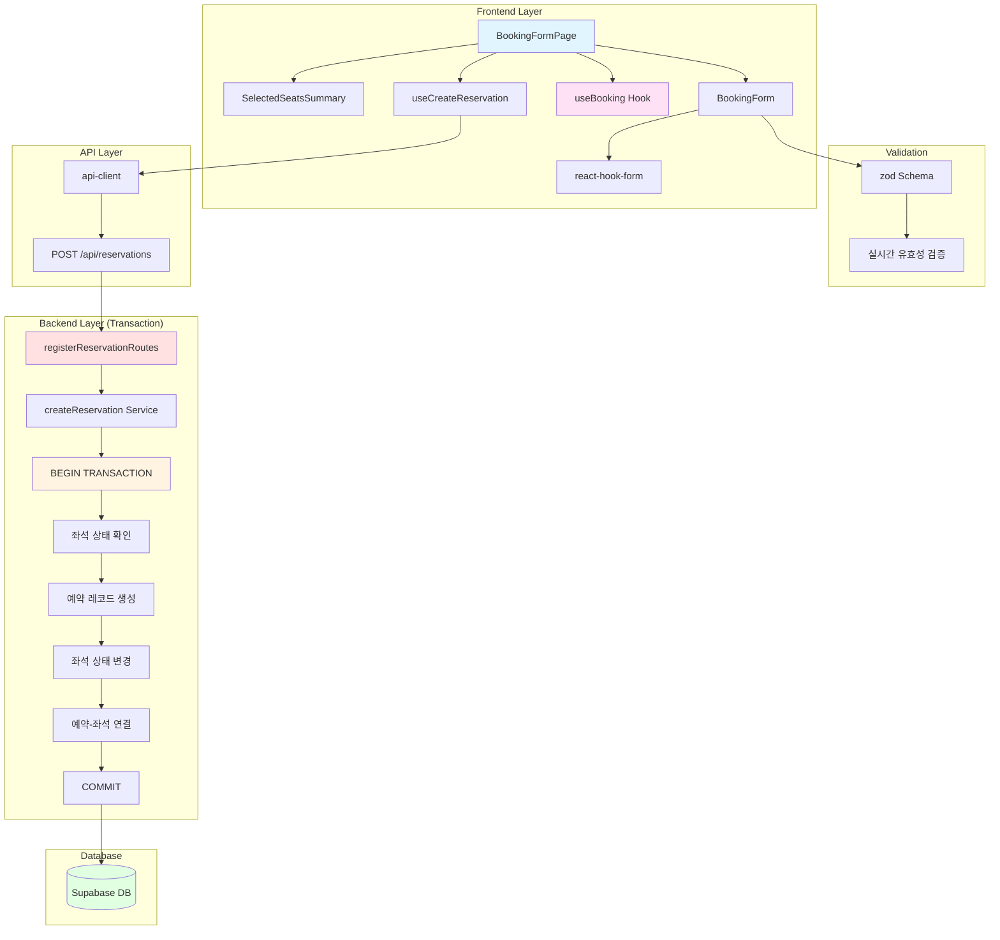

# Implementation Plan: 예약 정보 입력 페이지

## 개요

예약 정보 입력 페이지(`/concerts/[id]/booking`)를 구현하기 위한 모듈 설계. react-hook-form과 zod를 사용한 폼 관리 및 유효성 검증을 수행합니다.

### 모듈 목록

| 모듈명 | 위치 | 설명 |
|--------|------|------|
| **Frontend** |
| BookingFormPage | `src/app/concerts/[id]/booking/page.tsx` | 예약 정보 입력 페이지 |
| BookingForm | `src/features/reservation/components/booking-form.tsx` | 예약 폼 컴포넌트 |
| SelectedSeatsSum summary | `src/features/reservation/components/selected-seats-summary.tsx` | 선택 좌석 요약 |
| useCreateReservation | `src/features/reservation/hooks/use-create-reservation.ts` | 예약 생성 Mutation 훅 |
| **Backend** |
| createReservation | `src/features/reservation/backend/service.ts` | 예약 생성 서비스 |
| registerReservationRoutes | `src/features/reservation/backend/route.ts` | 예약 관련 API 라우터 |
| CreateReservationSchema | `src/features/reservation/backend/schema.ts` | 요청/응답 스키마 |
| reservationErrorCodes | `src/features/reservation/backend/error.ts` | 에러 코드 정의 |
| **Shared** |
| ReservationDTO | `src/features/reservation/lib/dto.ts` | 타입 재노출 |
| validatePhoneNumber | `src/lib/utils.ts` | 휴대폰번호 유효성 검증 (공통) |
| **Database** |
| reservations | `supabase/migrations/0005_create_reservations.sql` | 예약 테이블 |
| reservation_seats | `supabase/migrations/0005_create_reservations.sql` | 예약-좌석 연결 테이블 |

---

## Diagram



---

## Implementation Plan

### 1. Database Migration

**파일**: `supabase/migrations/0005_create_reservations.sql`

```sql
-- reservations 테이블
CREATE TYPE reservation_status_type AS ENUM ('CONFIRMED', 'CANCELLED');

CREATE TABLE IF NOT EXISTS reservations (
  id UUID PRIMARY KEY DEFAULT gen_random_uuid(),
  concert_id UUID NOT NULL REFERENCES concerts(id) ON DELETE RESTRICT,
  reservation_number VARCHAR(20) NOT NULL UNIQUE,
  customer_name VARCHAR(50) NOT NULL,
  phone_number VARCHAR(11) NOT NULL,
  password_hash VARCHAR(255) NOT NULL,
  total_amount INTEGER NOT NULL,
  status reservation_status_type NOT NULL DEFAULT 'CONFIRMED',
  created_at TIMESTAMP WITH TIME ZONE DEFAULT CURRENT_TIMESTAMP,
  updated_at TIMESTAMP WITH TIME ZONE DEFAULT CURRENT_TIMESTAMP
);

-- reservation_seats 테이블
CREATE TABLE IF NOT EXISTS reservation_seats (
  id UUID PRIMARY KEY DEFAULT gen_random_uuid(),
  reservation_id UUID NOT NULL REFERENCES reservations(id) ON DELETE CASCADE,
  seat_id UUID NOT NULL REFERENCES seats(id) ON DELETE RESTRICT,
  created_at TIMESTAMP WITH TIME ZONE DEFAULT CURRENT_TIMESTAMP,
  CONSTRAINT reservation_seats_unique UNIQUE(reservation_id, seat_id)
);

-- 인덱스
CREATE INDEX idx_reservations_phone ON reservations(phone_number);
CREATE INDEX idx_reservations_concert ON reservations(concert_id);
CREATE INDEX idx_reservations_number ON reservations(reservation_number);
CREATE INDEX idx_reservations_lookup ON reservations(phone_number, password_hash);
CREATE INDEX idx_reservation_seats_reservation ON reservation_seats(reservation_id);
CREATE INDEX idx_reservation_seats_seat ON reservation_seats(seat_id);

-- 트리거
CREATE TRIGGER update_reservations_updated_at
  BEFORE UPDATE ON reservations
  FOR EACH ROW
  EXECUTE FUNCTION update_updated_at_column();

-- RLS 비활성화
ALTER TABLE reservations DISABLE ROW LEVEL SECURITY;
ALTER TABLE reservation_seats DISABLE ROW LEVEL SECURITY;

-- 예약 번호 생성 함수
CREATE OR REPLACE FUNCTION generate_reservation_number()
RETURNS VARCHAR AS $$
DECLARE
  new_number VARCHAR;
  number_exists BOOLEAN;
BEGIN
  LOOP
    new_number := 'R' || LPAD(FLOOR(RANDOM() * 100000000)::TEXT, 8, '0');
    
    SELECT EXISTS(SELECT 1 FROM reservations WHERE reservation_number = new_number)
    INTO number_exists;
    
    EXIT WHEN NOT number_exists;
  END LOOP;
  
  RETURN new_number;
END;
$$ LANGUAGE plpgsql;
```

**충돌 여부**: ✅ 신규 마이그레이션, 충돌 없음

---

### 2. Backend Implementation

#### 2.1 Error Codes
**파일**: `src/features/reservation/backend/error.ts`

```typescript
export const reservationErrorCodes = {
  fetchError: 'RESERVATION_FETCH_ERROR',
  createError: 'RESERVATION_CREATE_ERROR',
  seatUnavailable: 'SEAT_UNAVAILABLE',
  invalidParams: 'RESERVATION_INVALID_PARAMS',
  notFound: 'RESERVATION_NOT_FOUND',
} as const;

export type ReservationServiceError =
  | { code: typeof reservationErrorCodes.fetchError; message: string }
  | { code: typeof reservationErrorCodes.createError; message: string }
  | { code: typeof reservationErrorCodes.seatUnavailable; message: string }
  | { code: typeof reservationErrorCodes.invalidParams; message: string }
  | { code: typeof reservationErrorCodes.notFound; message: string };
```

**충돌 여부**: ✅ 신규 feature, 충돌 없음

#### 2.2 Schema Definitions
**파일**: `src/features/reservation/backend/schema.ts`

```typescript
import { z } from 'zod';

export const CreateReservationSchema = z.object({
  concert_id: z.string().uuid(),
  seat_ids: z.array(z.string().uuid()).min(1, '최소 1개 이상의 좌석을 선택해야 합니다'),
  customer_name: z
    .string()
    .min(2, '이름은 최소 2자 이상이어야 합니다')
    .max(20, '이름은 최대 20자까지 입력 가능합니다'),
  phone_number: z
    .string()
    .regex(/^01\d{9,10}$/, '올바른 휴대폰 번호 형식이 아닙니다 (예: 01012345678)'),
  password: z
    .string()
    .regex(/^\d{4}$/, '비밀번호는 숫자 4자리여야 합니다'),
});

export const ReservationResponseSchema = z.object({
  reservation_number: z.string(),
  customer_name: z.string(),
  phone_number: z.string(),
  total_amount: z.number().int(),
  created_at: z.string().datetime(),
  concert: z.object({
    name: z.string(),
    date: z.string().datetime(),
    venue_name: z.string(),
  }),
  seats: z.array(
    z.object({
      section: z.enum(['A', 'B', 'C', 'D']),
      row: z.number().int(),
      column: z.number().int(),
      grade: z.enum(['SPECIAL', 'PREMIUM', 'ADVANCED', 'REGULAR']),
    })
  ),
});

export type CreateReservationInput = z.infer<typeof CreateReservationSchema>;
export type ReservationResponse = z.infer<typeof ReservationResponseSchema>;
```

**충돌 여부**: ✅ 신규 스키마, 충돌 없음

#### 2.3 Service Layer
**파일**: `src/features/reservation/backend/service.ts`

```typescript
import type { SupabaseClient } from '@supabase/supabase-js';
import { failure, success, type Result } from '@/backend/http/response';
import { reservationErrorCodes, type ReservationServiceError } from './error';
import type { CreateReservationInput, ReservationResponse } from './schema';
import bcrypt from 'bcryptjs';

export async function createReservation(
  supabase: SupabaseClient,
  input: CreateReservationInput
): Promise<Result<ReservationResponse, ReservationServiceError>> {
  try {
    // 트랜잭션 시작 (Supabase에서는 rpc로 처리)
    const { data: result, error: rpcError } = await supabase.rpc(
      'create_reservation_transaction',
      {
        p_concert_id: input.concert_id,
        p_seat_ids: input.seat_ids,
        p_customer_name: input.customer_name,
        p_phone_number: input.phone_number,
        p_password_hash: await bcrypt.hash(input.password, 10),
      }
    );

    if (rpcError || !result) {
      // 좌석이 이미 예약된 경우
      if (rpcError?.message?.includes('SEAT_UNAVAILABLE')) {
        return failure(409, reservationErrorCodes.seatUnavailable, '선택한 좌석이 이미 예약되었습니다');
      }
      return failure(500, reservationErrorCodes.createError, rpcError?.message || 'Failed to create reservation');
    }

    return success(result as ReservationResponse);
  } catch (err) {
    return failure(
      500,
      reservationErrorCodes.createError,
      err instanceof Error ? err.message : 'Unknown error'
    );
  }
}
```

**충돌 여부**: ✅ 신규 서비스, 충돌 없음

**Unit Test**:
```typescript
describe('createReservation', () => {
  it('should create reservation with valid input', async () => {
    const input = {
      concert_id: 'concert-123',
      seat_ids: ['seat-1', 'seat-2'],
      customer_name: '홍길동',
      phone_number: '01012345678',
      password: '1234',
    };
    
    const result = await createReservation(mockSupabase, input);
    expect(result.ok).toBe(true);
    if (result.ok) {
      expect(result.data).toHaveProperty('reservation_number');
      expect(result.data.total_amount).toBeGreaterThan(0);
    }
  });

  it('should fail if seat is already reserved', async () => {
    const result = await createReservation(mockSupabase, validInput);
    expect(result.ok).toBe(false);
    if (!result.ok) {
      expect(result.error.code).toBe(reservationErrorCodes.seatUnavailable);
      expect(result.status).toBe(409);
    }
  });

  it('should hash password before storing', async () => {
    const input = { ...validInput, password: '1234' };
    await createReservation(mockSupabase, input);
    
    // 비밀번호가 해시되었는지 확인
    expect(mockSupabase.rpc).toHaveBeenCalledWith(
      expect.any(String),
      expect.objectContaining({
        p_password_hash: expect.not.stringContaining('1234'),
      })
    );
  });
});
```

#### 2.4 Database Function (Transaction)
**파일**: `supabase/migrations/0006_create_reservation_transaction.sql`

```sql
CREATE OR REPLACE FUNCTION create_reservation_transaction(
  p_concert_id UUID,
  p_seat_ids UUID[],
  p_customer_name VARCHAR,
  p_phone_number VARCHAR,
  p_password_hash VARCHAR
)
RETURNS JSON AS $$
DECLARE
  v_reservation_id UUID;
  v_reservation_number VARCHAR;
  v_seat_id UUID;
  v_seat_status seat_status_type;
  v_total_amount INTEGER;
  v_result JSON;
BEGIN
  -- 1. 좌석 상태 확인 (FOR UPDATE로 잠금)
  FOREACH v_seat_id IN ARRAY p_seat_ids LOOP
    SELECT status INTO v_seat_status
    FROM seats
    WHERE id = v_seat_id AND concert_id = p_concert_id
    FOR UPDATE;
    
    IF NOT FOUND THEN
      RAISE EXCEPTION 'SEAT_NOT_FOUND: Seat % not found', v_seat_id;
    END IF;
    
    IF v_seat_status != 'AVAILABLE' THEN
      RAISE EXCEPTION 'SEAT_UNAVAILABLE: Seat % is not available', v_seat_id;
    END IF;
  END LOOP;

  -- 2. 총 금액 계산
  SELECT SUM(sg.price) INTO v_total_amount
  FROM seats s
  INNER JOIN concerts c ON s.concert_id = c.id
  INNER JOIN seat_grades sg ON s.grade = sg.name AND c.venue_id = sg.venue_id
  WHERE s.id = ANY(p_seat_ids);

  -- 3. 예약 번호 생성
  v_reservation_number := generate_reservation_number();

  -- 4. 예약 레코드 생성
  INSERT INTO reservations (
    concert_id, reservation_number, customer_name,
    phone_number, password_hash, total_amount, status
  ) VALUES (
    p_concert_id, v_reservation_number, p_customer_name,
    p_phone_number, p_password_hash, v_total_amount, 'CONFIRMED'
  ) RETURNING id INTO v_reservation_id;

  -- 5. 좌석 상태 변경
  UPDATE seats
  SET status = 'RESERVED', updated_at = CURRENT_TIMESTAMP
  WHERE id = ANY(p_seat_ids);

  -- 6. 예약-좌석 연결 생성
  FOREACH v_seat_id IN ARRAY p_seat_ids LOOP
    INSERT INTO reservation_seats (reservation_id, seat_id)
    VALUES (v_reservation_id, v_seat_id);
  END LOOP;

  -- 7. 결과 반환
  SELECT json_build_object(
    'reservation_number', r.reservation_number,
    'customer_name', r.customer_name,
    'phone_number', r.phone_number,
    'total_amount', r.total_amount,
    'created_at', r.created_at::TEXT,
    'concert', json_build_object(
      'name', c.name,
      'date', c.date::TEXT,
      'venue_name', v.name
    ),
    'seats', (
      SELECT json_agg(json_build_object(
        'section', s.section,
        'row', s.row,
        'column', s.column,
        'grade', s.grade
      ))
      FROM seats s
      INNER JOIN reservation_seats rs ON s.id = rs.seat_id
      WHERE rs.reservation_id = r.id
    )
  ) INTO v_result
  FROM reservations r
  INNER JOIN concerts c ON r.concert_id = c.id
  INNER JOIN venues v ON c.venue_id = v.id
  WHERE r.id = v_reservation_id;

  RETURN v_result;
END;
$$ LANGUAGE plpgsql;
```

**충돌 여부**: ✅ 신규 함수, 충돌 없음

#### 2.5 Route Handler
**파일**: `src/features/reservation/backend/route.ts`

```typescript
import type { Hono } from 'hono';
import { respond, failure } from '@/backend/http/response';
import { getLogger, getSupabase, type AppEnv } from '@/backend/hono/context';
import { CreateReservationSchema } from './schema';
import { createReservation } from './service';
import { reservationErrorCodes } from './error';

export const registerReservationRoutes = (app: Hono<AppEnv>) => {
  app.post('/reservations', async (c) => {
    const body = await c.req.json();
    const parsedBody = CreateReservationSchema.safeParse(body);

    if (!parsedBody.success) {
      return respond(
        c,
        failure(
          400,
          reservationErrorCodes.invalidParams,
          'Invalid request body',
          parsedBody.error.format()
        )
      );
    }

    const supabase = getSupabase(c);
    const logger = getLogger(c);

    const result = await createReservation(supabase, parsedBody.data);

    if (!result.ok) {
      logger.error('Failed to create reservation', result.error.message);
    }

    return respond(c, result);
  });
};
```

**충돌 여부**: ✅ 신규 라우터, app.ts에 등록 필요

#### 2.6 Hono App Registration
**파일**: `src/backend/hono/app.ts`

기존 코드에 추가:
```typescript
import { registerReservationRoutes } from '@/features/reservation/backend/route';

// createHonoApp 함수 내
registerReservationRoutes(app);
```

**충돌 여부**: ✅ 기존 패턴 따름, 충돌 없음

---

### 3. Frontend Implementation

#### 3.1 DTO Types
**파일**: `src/features/reservation/lib/dto.ts`

```typescript
export type {
  CreateReservationInput,
  ReservationResponse,
} from '../backend/schema';
```

**충돌 여부**: ✅ 신규 파일, 충돌 없음

#### 3.2 Utility Functions
**파일**: `src/lib/utils.ts`

기존 파일에 추가:
```typescript
export function validatePhoneNumber(phone: string): boolean {
  return /^01\d{9,10}$/.test(phone);
}

export function formatPhoneNumberInput(value: string): string {
  // 숫자만 추출
  return value.replace(/\D/g, '');
}
```

**충돌 여부**: ✅ 기존 파일에 함수 추가, 충돌 없음

#### 3.3 React Query Mutation Hook
**파일**: `src/features/reservation/hooks/use-create-reservation.ts`

```typescript
import { useMutation } from '@tanstack/react-query';
import { useRouter } from 'next/navigation';
import { apiClient } from '@/lib/remote/api-client';
import { useBooking } from '@/features/booking/context/use-booking';
import type { CreateReservationInput, ReservationResponse } from '../lib/dto';

export function useCreateReservation(concertId: string) {
  const router = useRouter();
  const { actions } = useBooking();

  return useMutation({
    mutationFn: async (input: Omit<CreateReservationInput, 'concert_id'>) => {
      const response = await apiClient.post<ReservationResponse>('/api/reservations', {
        ...input,
        concert_id: concertId,
      });
      return response.data;
    },
    onSuccess: (data) => {
      actions.clearSelection();
      router.push(`/concerts/${concertId}/confirmation?number=${data.reservation_number}`);
    },
  });
}
```

**충돌 여부**: ✅ 신규 훅, 충돌 없음

#### 3.4 SelectedSeatsSummary Component
**파일**: `src/features/reservation/components/selected-seats-summary.tsx`

```typescript
'use client';

import { Card, CardContent, CardHeader, CardTitle } from '@/components/ui/card';
import { formatPrice } from '@/lib/utils';
import { useBooking } from '@/features/booking/context/use-booking';

export function SelectedSeatsSummary() {
  const { state } = useBooking();

  return (
    <Card>
      <CardHeader>
        <CardTitle>선택한 좌석</CardTitle>
      </CardHeader>
      <CardContent className="space-y-3">
        <div className="text-sm text-muted-foreground">
          {state.selectedSeats.length}석 선택
        </div>
        
        <div className="space-y-2 max-h-40 overflow-y-auto">
          {state.selectedSeats.map((seat) => (
            <div
              key={seat.id}
              className="flex justify-between items-center text-sm border-b pb-2"
            >
              <span>
                {seat.section}구역 {seat.row}행 {seat.column}열
              </span>
              <span className="font-medium">{formatPrice(seat.price)}</span>
            </div>
          ))}
        </div>
        
        <div className="pt-3 border-t">
          <div className="flex justify-between items-center">
            <span className="font-semibold">총 금액</span>
            <span className="text-xl font-bold text-primary">
              {formatPrice(state.totalAmount)}
            </span>
          </div>
        </div>
      </CardContent>
    </Card>
  );
}
```

**충돌 여부**: ✅ 신규 컴포넌트, 충돌 없음

**QA Sheet**:
- [ ] 선택된 좌석 수 표시
- [ ] 좌석 목록 스크롤 가능
- [ ] 각 좌석 정보 및 가격 표시
- [ ] 총 금액 강조 표시

#### 3.5 BookingForm Component
**파일**: `src/features/reservation/components/booking-form.tsx`

```typescript
'use client';

import { useForm } from 'react-hook-form';
import { zodResolver } from '@hookform/resolvers/zod';
import { useRouter } from 'next/navigation';
import { ArrowLeft, Loader2 } from 'lucide-react';
import { Button } from '@/components/ui/button';
import {
  Form,
  FormControl,
  FormDescription,
  FormField,
  FormItem,
  FormLabel,
  FormMessage,
} from '@/components/ui/form';
import { Input } from '@/components/ui/input';
import { CreateReservationSchema } from '../backend/schema';
import { useCreateReservation } from '../hooks/use-create-reservation';
import { useBooking } from '@/features/booking/context/use-booking';
import { formatPhoneNumberInput } from '@/lib/utils';
import type { CreateReservationInput } from '../lib/dto';
import { z } from 'zod';

// 프론트엔드 폼용 스키마 (concert_id 제외)
const formSchema = CreateReservationSchema.omit({ concert_id: true, seat_ids: true });
type FormData = z.infer<typeof formSchema>;

interface BookingFormProps {
  concertId: string;
}

export function BookingForm({ concertId }: BookingFormProps) {
  const router = useRouter();
  const { state } = useBooking();
  const mutation = useCreateReservation(concertId);

  const form = useForm<FormData>({
    resolver: zodResolver(formSchema),
    defaultValues: {
      customer_name: '',
      phone_number: '',
      password: '',
    },
  });

  const onSubmit = (data: FormData) => {
    const seatIds = state.selectedSeats.map((seat) => seat.id);
    mutation.mutate({
      ...data,
      seat_ids: seatIds,
    });
  };

  const handlePrevious = () => {
    router.push(`/concerts/${concertId}/seats`);
  };

  return (
    <Form {...form}>
      <form onSubmit={form.handleSubmit(onSubmit)} className="space-y-6">
        <FormField
          control={form.control}
          name="customer_name"
          render={({ field }) => (
            <FormItem>
              <FormLabel>예약자명 *</FormLabel>
              <FormControl>
                <Input placeholder="홍길동" {...field} />
              </FormControl>
              <FormMessage />
            </FormItem>
          )}
        />

        <FormField
          control={form.control}
          name="phone_number"
          render={({ field }) => (
            <FormItem>
              <FormLabel>휴대폰번호 *</FormLabel>
              <FormControl>
                <Input
                  placeholder="01012345678"
                  {...field}
                  onChange={(e) => {
                    const formatted = formatPhoneNumberInput(e.target.value);
                    field.onChange(formatted);
                  }}
                  maxLength={11}
                />
              </FormControl>
              <FormDescription>예) 01012345678 (하이픈 없이)</FormDescription>
              <FormMessage />
            </FormItem>
          )}
        />

        <FormField
          control={form.control}
          name="password"
          render={({ field }) => (
            <FormItem>
              <FormLabel>비밀번호 (4자리) *</FormLabel>
              <FormControl>
                <Input
                  type="password"
                  placeholder="1234"
                  {...field}
                  onChange={(e) => {
                    const formatted = formatPhoneNumberInput(e.target.value);
                    field.onChange(formatted);
                  }}
                  maxLength={4}
                />
              </FormControl>
              <FormDescription>예약 조회 시 사용됩니다.</FormDescription>
              <FormMessage />
            </FormItem>
          )}
        />

        {mutation.isError && (
          <div className="p-3 bg-destructive/10 text-destructive rounded-md text-sm">
            {mutation.error instanceof Error
              ? mutation.error.message
              : '예약에 실패했습니다. 다시 시도해주세요.'}
          </div>
        )}

        <div className="flex gap-3">
          <Button
            type="button"
            variant="outline"
            onClick={handlePrevious}
            disabled={mutation.isPending}
            className="flex-1"
          >
            <ArrowLeft className="w-4 h-4 mr-2" />
            이전
          </Button>
          <Button
            type="submit"
            disabled={mutation.isPending}
            className="flex-1"
          >
            {mutation.isPending && (
              <Loader2 className="w-4 h-4 mr-2 animate-spin" />
            )}
            예약 완료
          </Button>
        </div>
      </form>
    </Form>
  );
}
```

**충돌 여부**: ✅ 신규 컴포넌트, 충돌 없음

**QA Sheet**:
- [ ] 모든 필드 필수 입력 검증
- [ ] 예약자명 길이 검증 (2~20자)
- [ ] 휴대폰번호 자동 포맷 (숫자만)
- [ ] 휴대폰번호 형식 검증 (01로 시작, 10~11자리)
- [ ] 비밀번호 자동 포맷 (숫자만, 4자리)
- [ ] 실시간 유효성 검증 피드백
- [ ] 제출 중 버튼 비활성화 및 로딩 표시
- [ ] 에러 시 에러 메시지 표시
- [ ] 이전 버튼으로 좌석 선택 페이지 이동
- [ ] Context 상태 유지

#### 3.6 Page Component
**파일**: `src/app/concerts/[id]/booking/page.tsx`

```typescript
'use client';

import { use, useEffect } from 'react';
import { useRouter } from 'next/navigation';
import { useBooking } from '@/features/booking/context/use-booking';
import { BookingForm } from '@/features/reservation/components/booking-form';
import { SelectedSeatsSummary } from '@/features/reservation/components/selected-seats-summary';

interface BookingFormPageProps {
  params: Promise<{ id: string }>;
}

export default function BookingFormPage({ params }: BookingFormPageProps) {
  const router = useRouter();
  const { id } = use(params);
  const { state } = useBooking();

  // 좌석 선택 여부 확인
  useEffect(() => {
    if (state.selectedSeats.length === 0) {
      router.push(`/concerts/${id}/seats`);
    }
  }, [state.selectedSeats.length, id, router]);

  if (state.selectedSeats.length === 0) {
    return null; // 리다이렉트 중
  }

  return (
    <div className="container mx-auto px-4 py-8">
      <h1 className="text-3xl font-bold mb-6">예약 정보 입력</h1>

      <div className="grid grid-cols-1 lg:grid-cols-3 gap-6">
        <div className="lg:col-span-2">
          <div className="bg-card border rounded-lg p-6">
            <BookingForm concertId={id} />
          </div>
        </div>
        <div>
          <SelectedSeatsSummary />
        </div>
      </div>
    </div>
  );
}
```

**충돌 여부**: ✅ 신규 페이지, 충돌 없음

**QA Sheet**:
- [ ] 좌석 미선택 시 좌석 선택 페이지로 리다이렉트
- [ ] 좌석 요약 정보 표시
- [ ] 폼과 요약 정보 반응형 레이아웃
- [ ] 예약 성공 시 예약 완료 페이지로 이동

---

### 4. Implementation Steps

1. **Database Setup**
   - [ ] reservations 테이블 마이그레이션
   - [ ] reservation_seats 테이블 마이그레이션
   - [ ] 예약 번호 생성 함수
   - [ ] 트랜잭션 함수 생성
   - [ ] Supabase에 적용

2. **Backend Implementation**
   - [ ] error.ts 작성
   - [ ] schema.ts 작성
   - [ ] service.ts 작성
   - [ ] service.ts unit test
   - [ ] route.ts 작성
   - [ ] app.ts에 라우터 등록

3. **Frontend Implementation**
   - [ ] dto.ts 작성
   - [ ] utils.ts에 유틸 함수 추가
   - [ ] use-create-reservation.ts 훅 작성
   - [ ] selected-seats-summary.tsx 컴포넌트
   - [ ] booking-form.tsx 컴포넌트
   - [ ] page.tsx 페이지

4. **Testing & QA**
   - [ ] Backend unit test 실행
   - [ ] 트랜잭션 동작 검증
   - [ ] Frontend QA sheet 확인
   - [ ] 유효성 검증 테스트
   - [ ] 중복 예약 방지 테스트

---

### 5. Edge Cases & Solutions

| 엣지케이스 | 대응 방안 |
|-----------|----------|
| 좌석 미선택 상태에서 접근 | 좌석 선택 페이지로 리다이렉트 |
| 유효성 검증 실패 | 필드별 에러 메시지 표시 |
| 좌석 중복 예약 | 트랜잭션 롤백 및 409 에러, 좌석 선택 페이지로 이동 |
| API 요청 중 타임아웃 | 에러 메시지 및 재시도 유도 |
| Context 상태 손실 | useEffect로 체크 후 리다이렉트 |
| 비밀번호 해시 실패 | 500 에러 및 재시도 |
| 휴대폰번호 하이픈 입력 | 자동 제거 및 검증 |

---

### 6. Shared Modules (DRY)

| 모듈 | 재사용처 |
|------|---------|
| `formatPrice` | 콘서트 상세, 좌석 선택, 예약 조회 |
| `validatePhoneNumber` | 예약 조회 |
| `formatPhoneNumberInput` | 예약 조회 |
| `useBooking` 훅 | 좌석 선택, 예약 완료 |
| `ReservationResponse` 타입 | 예약 완료, 예약 조회 |

---

**작성일**: 2025-10-15

