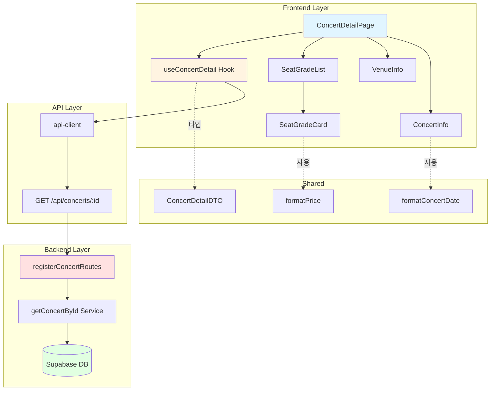

# Implementation Plan: 콘서트 상세 페이지

## 개요

콘서트 상세 페이지(`/concerts/[id]`)를 구현하기 위한 모듈 설계

### 모듈 목록

| 모듈명 | 위치 | 설명 |
|--------|------|------|
| **Frontend** |
| ConcertDetailPage | `src/app/concerts/[id]/page.tsx` | 콘서트 상세 페이지 컴포넌트 |
| ConcertInfo | `src/features/concert/components/concert-info.tsx` | 콘서트 정보 섹션 |
| VenueInfo | `src/features/concert/components/venue-info.tsx` | 공연장 정보 섹션 |
| SeatGradeList | `src/features/concert/components/seat-grade-list.tsx` | 좌석 등급 목록 |
| SeatGradeCard | `src/features/concert/components/seat-grade-card.tsx` | 개별 좌석 등급 카드 |
| useConcertDetail | `src/features/concert/hooks/use-concert-detail.ts` | 콘서트 상세 조회 React Query 훅 |
| **Backend** |
| getConcertById | `src/features/concert/backend/service.ts` | 콘서트 상세 조회 서비스 (추가) |
| ConcertDetailResponseSchema | `src/features/concert/backend/schema.ts` | 응답 스키마 정의 (추가) |
| **Shared** |
| ConcertDetailDTO | `src/features/concert/lib/dto.ts` | 타입 재노출 (추가) |
| formatConcertDate | `src/lib/utils.ts` | 날짜 포맷 (재사용) |
| formatPrice | `src/lib/utils.ts` | 가격 포맷 유틸리티 (신규) |
| **Database** |
| seat_grades | `supabase/migrations/0003_create_seats.sql` | 좌석 등급 테이블 |

---

## Diagram



---

## Implementation Plan

### 1. Database Migration

**파일**: `supabase/migrations/0003_create_seats.sql`

```sql
-- seat_grades 테이블
CREATE TYPE seat_grade_type AS ENUM ('SPECIAL', 'PREMIUM', 'ADVANCED', 'REGULAR');

CREATE TABLE IF NOT EXISTS seat_grades (
  id UUID PRIMARY KEY DEFAULT gen_random_uuid(),
  venue_id UUID NOT NULL REFERENCES venues(id) ON DELETE CASCADE,
  name seat_grade_type NOT NULL,
  price INTEGER NOT NULL,
  row_start INTEGER NOT NULL,
  row_end INTEGER NOT NULL,
  created_at TIMESTAMP WITH TIME ZONE DEFAULT CURRENT_TIMESTAMP,
  updated_at TIMESTAMP WITH TIME ZONE DEFAULT CURRENT_TIMESTAMP,
  CONSTRAINT seat_grades_venue_name_unique UNIQUE(venue_id, name)
);

CREATE INDEX idx_seat_grades_venue ON seat_grades(venue_id);

CREATE TRIGGER update_seat_grades_updated_at
  BEFORE UPDATE ON seat_grades
  FOR EACH ROW
  EXECUTE FUNCTION update_updated_at_column();

ALTER TABLE seat_grades DISABLE ROW LEVEL SECURITY;
```

**충돌 여부**: ✅ 신규 마이그레이션, 충돌 없음

---

### 2. Backend Implementation

#### 2.1 Schema Additions
**파일**: `src/features/concert/backend/schema.ts`

기존 파일에 추가:
```typescript
export const SeatGradeSchema = z.object({
  name: z.enum(['SPECIAL', 'PREMIUM', 'ADVANCED', 'REGULAR']),
  price: z.number().int().positive(),
  row_start: z.number().int().positive(),
  row_end: z.number().int().positive(),
  total_seats: z.number().int().min(0),
  reserved_count: z.number().int().min(0),
});

export const VenueSchema = z.object({
  name: z.string(),
  address: z.string(),
  section_count: z.number().int().positive(),
  rows_per_section: z.number().int().positive(),
  columns_per_section: z.number().int().positive(),
});

export const ConcertDetailSchema = z.object({
  id: z.string().uuid(),
  name: z.string(),
  date: z.string().datetime(),
  description: z.string().nullable(),
  poster_url: z.string().url().nullable(),
  venue: VenueSchema,
  seat_grades: z.array(SeatGradeSchema),
});

export const ConcertDetailResponseSchema = z.object({
  concert: ConcertDetailSchema,
});

export const ConcertParamsSchema = z.object({
  id: z.string().uuid('Invalid concert ID format'),
});

export type SeatGrade = z.infer<typeof SeatGradeSchema>;
export type Venue = z.infer<typeof VenueSchema>;
export type ConcertDetail = z.infer<typeof ConcertDetailSchema>;
export type ConcertDetailResponse = z.infer<typeof ConcertDetailResponseSchema>;
export type ConcertParams = z.infer<typeof ConcertParamsSchema>;
```

**충돌 여부**: ✅ 기존 파일 확장, 충돌 없음

#### 2.2 Service Layer Addition
**파일**: `src/features/concert/backend/service.ts`

기존 파일에 추가:
```typescript
export async function getConcertById(
  supabase: SupabaseClient,
  concertId: string
): Promise<Result<ConcertDetailResponse, ConcertServiceError>> {
  try {
    // 콘서트 및 공연장 정보 조회
    const { data: concert, error: concertError } = await supabase
      .from('concerts')
      .select(`
        id,
        name,
        date,
        description,
        poster_url,
        venues!inner(
          name,
          address,
          section_count,
          rows_per_section,
          columns_per_section
        )
      `)
      .eq('id', concertId)
      .single();

    if (concertError || !concert) {
      return failure(404, concertErrorCodes.notFound, 'Concert not found');
    }

    // 좌석 등급 정보 조회
    const { data: seatGrades, error: gradesError } = await supabase
      .from('seat_grades')
      .select('*')
      .eq('venue_id', concert.venues.id)
      .order('price', { ascending: false });

    if (gradesError) {
      return failure(500, concertErrorCodes.fetchError, gradesError.message);
    }

    // 각 등급별 예약 현황 조회
    const gradesWithReservation = await Promise.all(
      seatGrades.map(async (grade) => {
        const { data: seats, error: seatsError } = await supabase
          .from('seats')
          .select('id, status')
          .eq('concert_id', concertId)
          .eq('grade', grade.name);

        const totalSeats = seats?.length || 0;
        const reservedCount = seats?.filter((s) => s.status === 'RESERVED').length || 0;

        return {
          name: grade.name,
          price: grade.price,
          row_start: grade.row_start,
          row_end: grade.row_end,
          total_seats: totalSeats,
          reserved_count: reservedCount,
        };
      })
    );

    return success({
      concert: {
        id: concert.id,
        name: concert.name,
        date: concert.date,
        description: concert.description,
        poster_url: concert.poster_url,
        venue: {
          name: concert.venues.name,
          address: concert.venues.address,
          section_count: concert.venues.section_count,
          rows_per_section: concert.venues.rows_per_section,
          columns_per_section: concert.venues.columns_per_section,
        },
        seat_grades: gradesWithReservation,
      },
    });
  } catch (err) {
    return failure(
      500,
      concertErrorCodes.fetchError,
      err instanceof Error ? err.message : 'Unknown error'
    );
  }
}
```

**충돌 여부**: ✅ 기존 파일에 함수 추가, 충돌 없음

**Unit Test**:
```typescript
describe('getConcertById', () => {
  it('should return concert detail with venue and seat grades', async () => {
    const result = await getConcertById(mockSupabase, 'concert-id-123');
    expect(result.ok).toBe(true);
    if (result.ok) {
      expect(result.data.concert).toHaveProperty('venue');
      expect(result.data.concert).toHaveProperty('seat_grades');
      expect(result.data.concert.seat_grades).toHaveLength(4);
    }
  });

  it('should return 404 for non-existent concert', async () => {
    const result = await getConcertById(mockSupabase, 'non-existent-id');
    expect(result.ok).toBe(false);
    if (!result.ok) {
      expect(result.error.code).toBe(concertErrorCodes.notFound);
      expect(result.status).toBe(404);
    }
  });

  it('should calculate reservation counts correctly', async () => {
    const result = await getConcertById(mockSupabase, 'concert-id-123');
    if (result.ok) {
      result.data.concert.seat_grades.forEach((grade) => {
        expect(grade.reserved_count).toBeLessThanOrEqual(grade.total_seats);
      });
    }
  });
});
```

#### 2.3 Route Handler Addition
**파일**: `src/features/concert/backend/route.ts`

기존 파일에 추가:
```typescript
import { ConcertParamsSchema } from './schema';
import { getConcertById } from './service';

// registerConcertRoutes 함수 내에 추가
app.get('/concerts/:id', async (c) => {
  const parsedParams = ConcertParamsSchema.safeParse({
    id: c.req.param('id'),
  });

  if (!parsedParams.success) {
    return respond(
      c,
      failure(
        400,
        concertErrorCodes.invalidParams,
        'Invalid concert ID',
        parsedParams.error.format()
      )
    );
  }

  const supabase = getSupabase(c);
  const logger = getLogger(c);

  const result = await getConcertById(supabase, parsedParams.data.id);

  if (!result.ok) {
    logger.error('Failed to fetch concert detail', result.error.message);
  }

  return respond(c, result);
});
```

**충돌 여부**: ✅ 기존 라우터에 엔드포인트 추가, 충돌 없음

---

### 3. Frontend Implementation

#### 3.1 DTO Type Export Addition
**파일**: `src/features/concert/lib/dto.ts`

기존 파일에 추가:
```typescript
export type {
  Concert,
  ConcertListResponse,
  ConcertDetail,
  ConcertDetailResponse,
  SeatGrade,
  Venue,
} from '../backend/schema';
```

**충돌 여부**: ✅ 기존 파일 확장, 충돌 없음

#### 3.2 Utility Function Addition
**파일**: `src/lib/utils.ts`

기존 함수에 추가:
```typescript
export function formatPrice(price: number): string {
  return price.toLocaleString('ko-KR') + '원';
}
```

**충돌 여부**: ✅ 기존 파일에 함수 추가, 충돌 없음

#### 3.3 React Query Hook
**파일**: `src/features/concert/hooks/use-concert-detail.ts`

```typescript
import { useQuery } from '@tanstack/react-query';
import { apiClient } from '@/lib/remote/api-client';
import type { ConcertDetailResponse } from '../lib/dto';

export function useConcertDetail(concertId: string) {
  return useQuery({
    queryKey: ['concert', concertId],
    queryFn: async () => {
      const response = await apiClient.get<ConcertDetailResponse>(
        `/api/concerts/${concertId}`
      );
      return response.data;
    },
    enabled: !!concertId,
    staleTime: 1000 * 60 * 5, // 5분
    retry: 3,
  });
}
```

**충돌 여부**: ✅ 신규 훅, 충돌 없음

#### 3.4 ConcertInfo Component
**파일**: `src/features/concert/components/concert-info.tsx`

```typescript
'use client';

import { Calendar, MapPin } from 'lucide-react';
import Image from 'next/image';
import { Card, CardContent, CardHeader, CardTitle } from '@/components/ui/card';
import { formatConcertDate } from '@/lib/utils';
import type { ConcertDetail } from '../lib/dto';

interface ConcertInfoProps {
  concert: ConcertDetail;
}

export function ConcertInfo({ concert }: ConcertInfoProps) {
  const formattedDate = formatConcertDate(concert.date);

  return (
    <Card>
      <CardHeader>
        <CardTitle>콘서트 정보</CardTitle>
      </CardHeader>
      <CardContent className="space-y-4">
        <div className="relative aspect-[3/4] max-w-sm mx-auto">
          <Image
            src={concert.poster_url || `https://picsum.photos/seed/${concert.id}/400/600`}
            alt={concert.name}
            fill
            className="object-cover rounded-lg"
            onError={(e) => {
              e.currentTarget.src = `https://picsum.photos/seed/${concert.id}/400/600`;
            }}
          />
        </div>
        <div>
          <h2 className="text-2xl font-bold mb-2">{concert.name}</h2>
          {concert.description && (
            <p className="text-muted-foreground whitespace-pre-line">
              {concert.description}
            </p>
          )}
        </div>
        <div className="space-y-2">
          <div className="flex items-center gap-2">
            <Calendar className="w-5 h-5 text-muted-foreground" />
            <span>{formattedDate}</span>
          </div>
          <div className="flex items-center gap-2">
            <MapPin className="w-5 h-5 text-muted-foreground" />
            <span>{concert.venue.name}</span>
          </div>
        </div>
      </CardContent>
    </Card>
  );
}
```

**충돌 여부**: ✅ 신규 컴포넌트, 충돌 없음

**QA Sheet**:
- [ ] 포스터 이미지 표시 및 fallback 처리
- [ ] 콘서트명 표시
- [ ] 상세 설명이 있을 때만 표시
- [ ] 줄바꿈 처리 (whitespace-pre-line)
- [ ] 날짜 및 장소 정보 아이콘과 함께 표시

#### 3.5 VenueInfo Component
**파일**: `src/features/concert/components/venue-info.tsx`

```typescript
'use client';

import { Building2, Grid3x3 } from 'lucide-react';
import { Card, CardContent, CardHeader, CardTitle } from '@/components/ui/card';
import type { Venue } from '../lib/dto';

interface VenueInfoProps {
  venue: Venue;
}

export function VenueInfo({ venue }: VenueInfoProps) {
  const totalSeats =
    venue.section_count * venue.rows_per_section * venue.columns_per_section;

  return (
    <Card>
      <CardHeader>
        <CardTitle>공연장 정보</CardTitle>
      </CardHeader>
      <CardContent className="space-y-3">
        <div className="flex items-start gap-2">
          <Building2 className="w-5 h-5 text-muted-foreground mt-0.5" />
          <div>
            <p className="font-medium">{venue.name}</p>
            <p className="text-sm text-muted-foreground">{venue.address}</p>
          </div>
        </div>
        <div className="flex items-start gap-2">
          <Grid3x3 className="w-5 h-5 text-muted-foreground mt-0.5" />
          <div className="text-sm">
            <p>
              구역: {venue.section_count}개 (A, B, C, D)
            </p>
            <p>
              좌석 구성: {venue.rows_per_section}행 × {venue.columns_per_section}열
            </p>
            <p className="text-muted-foreground">총 {totalSeats}석</p>
          </div>
        </div>
      </CardContent>
    </Card>
  );
}
```

**충돌 여부**: ✅ 신규 컴포넌트, 충돌 없음

**QA Sheet**:
- [ ] 공연장명 및 주소 표시
- [ ] 좌석 구성 정보 표시
- [ ] 총 좌석 수 자동 계산

#### 3.6 SeatGradeCard Component
**파일**: `src/features/concert/components/seat-grade-card.tsx`

```typescript
'use client';

import { Badge } from '@/components/ui/badge';
import { Card, CardContent } from '@/components/ui/card';
import { Progress } from '@/components/ui/progress';
import { formatPrice } from '@/lib/utils';
import type { SeatGrade } from '../lib/dto';

interface SeatGradeCardProps {
  grade: SeatGrade;
}

const gradeColors = {
  SPECIAL: 'bg-yellow-500',
  PREMIUM: 'bg-blue-500',
  ADVANCED: 'bg-green-500',
  REGULAR: 'bg-gray-500',
};

const gradeLabels = {
  SPECIAL: 'Special',
  PREMIUM: 'Premium',
  ADVANCED: 'Advanced',
  REGULAR: 'Regular',
};

export function SeatGradeCard({ grade }: SeatGradeCardProps) {
  const availableSeats = grade.total_seats - grade.reserved_count;
  const reservationRate = (grade.reserved_count / grade.total_seats) * 100;

  return (
    <Card>
      <CardContent className="p-4 space-y-3">
        <div className="flex items-center justify-between">
          <Badge className={gradeColors[grade.name]}>
            {gradeLabels[grade.name]}
          </Badge>
          <span className="text-lg font-bold">{formatPrice(grade.price)}</span>
        </div>
        <div className="text-sm text-muted-foreground">
          <p>좌석 범위: {grade.row_start}~{grade.row_end}열</p>
          <p>
            잔여석: {availableSeats}/{grade.total_seats}석
          </p>
        </div>
        <Progress value={reservationRate} className="h-2" />
      </CardContent>
    </Card>
  );
}
```

**충돌 여부**: ✅ 신규 컴포넌트, 충돌 없음

**QA Sheet**:
- [ ] 등급별 색상 표시
- [ ] 가격 포맷 표시
- [ ] 좌석 범위 표시
- [ ] 잔여석 정보 표시
- [ ] 예약률 프로그레스 바 표시

#### 3.7 SeatGradeList Component
**파일**: `src/features/concert/components/seat-grade-list.tsx`

```typescript
'use client';

import { Card, CardContent, CardHeader, CardTitle } from '@/components/ui/card';
import { SeatGradeCard } from './seat-grade-card';
import type { SeatGrade } from '../lib/dto';

interface SeatGradeListProps {
  grades: SeatGrade[];
}

export function SeatGradeList({ grades }: SeatGradeListProps) {
  return (
    <Card>
      <CardHeader>
        <CardTitle>좌석 등급 및 가격</CardTitle>
      </CardHeader>
      <CardContent>
        <div className="grid grid-cols-1 sm:grid-cols-2 lg:grid-cols-4 gap-4">
          {grades.map((grade) => (
            <SeatGradeCard key={grade.name} grade={grade} />
          ))}
        </div>
      </CardContent>
    </Card>
  );
}
```

**충돌 여부**: ✅ 신규 컴포넌트, 충돌 없음

**QA Sheet**:
- [ ] 등급 카드 그리드 레이아웃 (1/2/4 컬럼)
- [ ] 반응형 동작 확인

#### 3.8 Page Component
**파일**: `src/app/concerts/[id]/page.tsx`

```typescript
'use client';

import { useRouter } from 'next/navigation';
import { use } from 'react';
import { Loader2, ArrowLeft } from 'lucide-react';
import { Button } from '@/components/ui/button';
import { useConcertDetail } from '@/features/concert/hooks/use-concert-detail';
import { ConcertInfo } from '@/features/concert/components/concert-info';
import { VenueInfo } from '@/features/concert/components/venue-info';
import { SeatGradeList } from '@/features/concert/components/seat-grade-list';

interface ConcertDetailPageProps {
  params: Promise<{ id: string }>;
}

export default function ConcertDetailPage({ params }: ConcertDetailPageProps) {
  const router = useRouter();
  const { id } = use(params);
  const { data, isLoading, error } = useConcertDetail(id);

  if (isLoading) {
    return (
      <div className="flex justify-center items-center min-h-[400px]">
        <Loader2 className="w-8 h-8 animate-spin text-primary" />
      </div>
    );
  }

  if (error || !data) {
    return (
      <div className="container mx-auto px-4 py-8">
        <Button
          variant="ghost"
          onClick={() => router.push('/concerts')}
          className="mb-4"
        >
          <ArrowLeft className="w-4 h-4 mr-2" />
          목록으로
        </Button>
        <div className="text-center py-12 space-y-4">
          <p className="text-destructive">콘서트 정보를 불러오는데 실패했습니다.</p>
          <Button onClick={() => router.push('/concerts')}>목록으로 돌아가기</Button>
        </div>
      </div>
    );
  }

  const concert = data.concert;
  const isSoldOut = concert.seat_grades.every(
    (g) => g.reserved_count >= g.total_seats
  );
  const isPastConcert = new Date(concert.date) < new Date();

  return (
    <div className="container mx-auto px-4 py-8">
      <Button
        variant="ghost"
        onClick={() => router.push('/concerts')}
        className="mb-4"
      >
        <ArrowLeft className="w-4 h-4 mr-2" />
        목록으로
      </Button>

      <div className="space-y-6">
        <ConcertInfo concert={concert} />
        <VenueInfo venue={concert.venue} />
        <SeatGradeList grades={concert.seat_grades} />

        <div className="flex justify-center">
          <Button
            size="lg"
            onClick={() => router.push(`/concerts/${id}/seats`)}
            disabled={isSoldOut || isPastConcert}
          >
            {isSoldOut
              ? '매진되었습니다'
              : isPastConcert
              ? '예약 기간이 종료되었습니다'
              : '좌석 선택하기'}
          </Button>
        </div>
      </div>
    </div>
  );
}
```

**충돌 여부**: ✅ 신규 페이지, 충돌 없음

**QA Sheet**:
- [ ] 로딩 중 스피너 표시
- [ ] 에러 시 404 페이지 및 목록으로 버튼
- [ ] 목록으로 돌아가기 버튼 동작
- [ ] 콘서트 정보, 공연장 정보, 좌석 등급 순서로 표시
- [ ] 좌석 선택하기 버튼 조건부 비활성화
  - 매진 시
  - 과거 콘서트 시
- [ ] 버튼 텍스트 상태별 변경

---

### 4. Required Dependencies

#### 4.1 shadcn-ui Components
```bash
$ npx shadcn@latest add progress
```

**충돌 여부**: ✅ 신규 컴포넌트 설치 필요

---

### 5. Implementation Steps

1. **Database Setup**
   - [ ] seat_grades 테이블 마이그레이션 작성
   - [ ] Supabase에 적용
   - [ ] 샘플 데이터 추가

2. **Backend Implementation**
   - [ ] schema.ts에 타입 추가
   - [ ] service.ts에 getConcertById 함수 추가
   - [ ] unit test 작성 및 실행
   - [ ] route.ts에 엔드포인트 추가

3. **Shared Layer**
   - [ ] dto.ts에 타입 export 추가
   - [ ] utils.ts에 formatPrice 함수 추가

4. **Frontend Implementation**
   - [ ] progress 컴포넌트 설치
   - [ ] use-concert-detail.ts 훅 작성
   - [ ] concert-info.tsx 컴포넌트 작성
   - [ ] venue-info.tsx 컴포넌트 작성
   - [ ] seat-grade-card.tsx 컴포넌트 작성
   - [ ] seat-grade-list.tsx 컴포넌트 작성
   - [ ] page.tsx 페이지 작성

5. **Testing & QA**
   - [ ] Backend unit test 실행
   - [ ] Frontend QA sheet 확인
   - [ ] 통합 테스트
   - [ ] 404 케이스 테스트

---

### 6. Edge Cases & Solutions

| 엣지케이스 | 대응 방안 |
|-----------|----------|
| 존재하지 않는 콘서트 ID | 404 페이지 및 목록으로 버튼 제공 |
| 매진된 콘서트 | 버튼 비활성화 및 "매진" 텍스트 표시 |
| 과거 콘서트 | 버튼 비활성화 및 안내 메시지 |
| 포스터 이미지 로드 실패 | onError fallback 처리 |
| 잘못된 UUID 형식 | 파라미터 유효성 검증, 400 에러 |
| 상세 설명 없음 | 조건부 렌더링으로 미표시 |

---

### 7. Shared Modules (DRY)

| 모듈 | 재사용처 |
|------|---------|
| `formatPrice` | 좌석 선택, 예약 정보 입력, 예약 조회 |
| `formatConcertDate` | 콘서트 목록, 예약 확인, 예약 조회 |
| `SeatGrade` 타입 | 좌석 선택 페이지 |
| `concertErrorCodes` | 모든 콘서트 관련 API |

---

**작성일**: 2025-10-15

