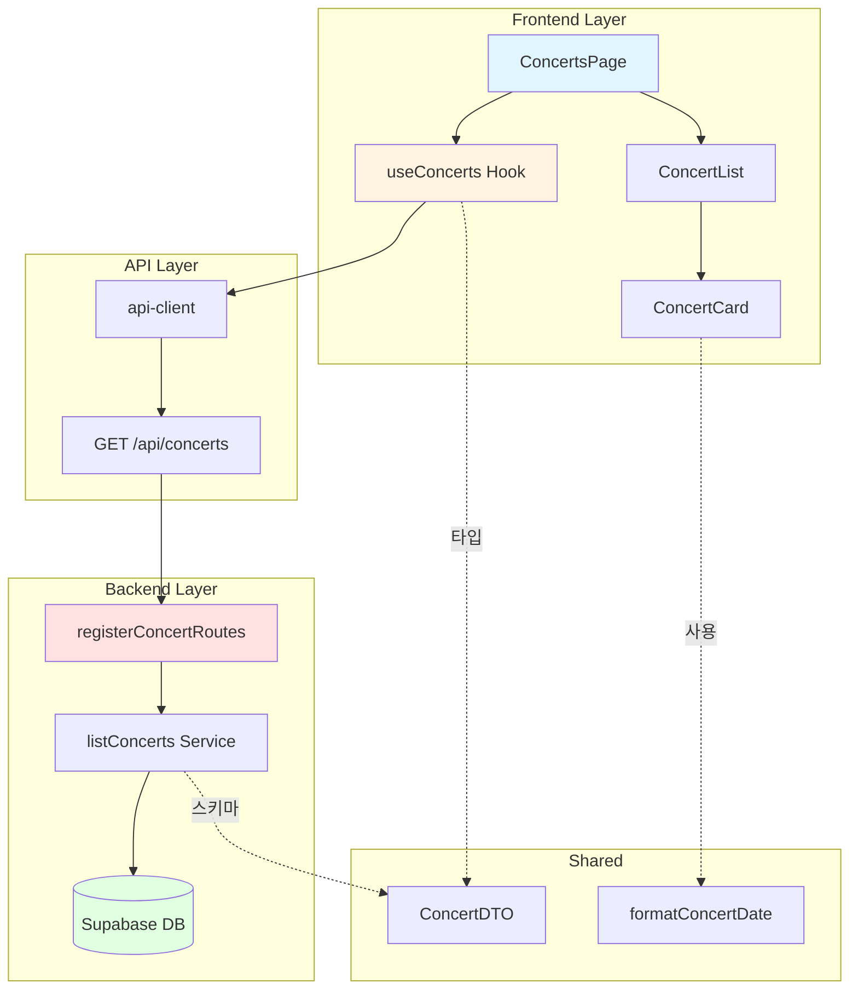

# Implementation Plan: 콘서트 목록 페이지

## 개요

콘서트 목록 페이지(`/concerts`)를 구현하기 위한 모듈 설계

### 모듈 목록

| 모듈명 | 위치 | 설명 |
|--------|------|------|
| **Frontend** |
| ConcertsPage | `src/app/concerts/page.tsx` | 콘서트 목록 페이지 컴포넌트 |
| ConcertList | `src/features/concert/components/concert-list.tsx` | 콘서트 카드 목록 컨테이너 |
| ConcertCard | `src/features/concert/components/concert-card.tsx` | 개별 콘서트 카드 컴포넌트 |
| useConcerts | `src/features/concert/hooks/use-concerts.ts` | 콘서트 목록 조회 React Query 훅 |
| **Backend** |
| registerConcertRoutes | `src/features/concert/backend/route.ts` | 콘서트 관련 API 라우터 |
| listConcerts | `src/features/concert/backend/service.ts` | 콘서트 목록 조회 서비스 |
| ConcertListResponseSchema | `src/features/concert/backend/schema.ts` | 응답 스키마 정의 |
| concertErrorCodes | `src/features/concert/backend/error.ts` | 에러 코드 정의 |
| **Shared** |
| ConcertDTO | `src/features/concert/lib/dto.ts` | 클라이언트 측 타입 재노출 |
| formatConcertDate | `src/lib/utils.ts` | 날짜 포맷 유틸리티 (공통) |
| **Database** |
| concerts | `supabase/migrations/0002_create_concerts.sql` | 콘서트 테이블 |
| venues | `supabase/migrations/0002_create_concerts.sql` | 공연장 테이블 |

---

## Diagram



---

## Implementation Plan

### 1. Database Migration

**파일**: `supabase/migrations/0002_create_concerts.sql`

```sql
-- venues 테이블
CREATE TABLE IF NOT EXISTS venues (
  id UUID PRIMARY KEY DEFAULT gen_random_uuid(),
  name VARCHAR(100) NOT NULL,
  address VARCHAR(255) NOT NULL,
  section_count INTEGER NOT NULL DEFAULT 4,
  rows_per_section INTEGER NOT NULL DEFAULT 4,
  columns_per_section INTEGER NOT NULL DEFAULT 20,
  created_at TIMESTAMP WITH TIME ZONE DEFAULT CURRENT_TIMESTAMP,
  updated_at TIMESTAMP WITH TIME ZONE DEFAULT CURRENT_TIMESTAMP
);

-- concerts 테이블
CREATE TABLE IF NOT EXISTS concerts (
  id UUID PRIMARY KEY DEFAULT gen_random_uuid(),
  venue_id UUID NOT NULL REFERENCES venues(id) ON DELETE RESTRICT,
  name VARCHAR(200) NOT NULL,
  date TIMESTAMP WITH TIME ZONE NOT NULL,
  description TEXT,
  poster_url VARCHAR(500),
  created_at TIMESTAMP WITH TIME ZONE DEFAULT CURRENT_TIMESTAMP,
  updated_at TIMESTAMP WITH TIME ZONE DEFAULT CURRENT_TIMESTAMP
);

-- 인덱스
CREATE INDEX idx_concerts_date ON concerts(date);
CREATE INDEX idx_concerts_venue ON concerts(venue_id);

-- 트리거
CREATE TRIGGER update_venues_updated_at
  BEFORE UPDATE ON venues
  FOR EACH ROW
  EXECUTE FUNCTION update_updated_at_column();

CREATE TRIGGER update_concerts_updated_at
  BEFORE UPDATE ON concerts
  FOR EACH ROW
  EXECUTE FUNCTION update_updated_at_column();

-- RLS 비활성화
ALTER TABLE venues DISABLE ROW LEVEL SECURITY;
ALTER TABLE concerts DISABLE ROW LEVEL SECURITY;
```

**충돌 여부**: ✅ 신규 마이그레이션, 충돌 없음

---

### 2. Backend Implementation

#### 2.1 Error Codes
**파일**: `src/features/concert/backend/error.ts`

```typescript
export const concertErrorCodes = {
  fetchError: 'CONCERT_FETCH_ERROR',
  notFound: 'CONCERT_NOT_FOUND',
  invalidParams: 'CONCERT_INVALID_PARAMS',
} as const;

export type ConcertServiceError =
  | { code: typeof concertErrorCodes.fetchError; message: string }
  | { code: typeof concertErrorCodes.notFound; message: string }
  | { code: typeof concertErrorCodes.invalidParams; message: string };
```

**충돌 여부**: ✅ 신규 feature, 충돌 없음

#### 2.2 Schema Definitions
**파일**: `src/features/concert/backend/schema.ts`

```typescript
import { z } from 'zod';

export const ConcertSchema = z.object({
  id: z.string().uuid(),
  name: z.string(),
  date: z.string().datetime(),
  poster_url: z.string().url().nullable(),
  venue_name: z.string(),
  reserved_count: z.number().int().min(0),
  total_seats: z.number().int().min(0),
});

export const ConcertListResponseSchema = z.object({
  concerts: z.array(ConcertSchema),
});

export type Concert = z.infer<typeof ConcertSchema>;
export type ConcertListResponse = z.infer<typeof ConcertListResponseSchema>;
```

**충돌 여부**: ✅ 신규 스키마, 충돌 없음

#### 2.3 Service Layer
**파일**: `src/features/concert/backend/service.ts`

```typescript
import type { SupabaseClient } from '@supabase/supabase-js';
import { failure, success, type Result } from '@/backend/http/response';
import { concertErrorCodes, type ConcertServiceError } from './error';
import type { ConcertListResponse } from './schema';

export async function listConcerts(
  supabase: SupabaseClient
): Promise<Result<ConcertListResponse, ConcertServiceError>> {
  try {
    const { data: concerts, error } = await supabase
      .from('concerts')
      .select(`
        id,
        name,
        date,
        poster_url,
        venues!inner(name)
      `)
      .order('date', { ascending: true });

    if (error) {
      return failure(500, concertErrorCodes.fetchError, error.message);
    }

    // 각 콘서트의 좌석 예약 현황 조회
    const concertsWithReservation = await Promise.all(
      concerts.map(async (concert) => {
        const { data: seats, error: seatsError } = await supabase
          .from('seats')
          .select('id, status')
          .eq('concert_id', concert.id);

        if (seatsError) {
          return {
            ...concert,
            venue_name: concert.venues.name,
            reserved_count: 0,
            total_seats: 320, // 4구역 × 4행 × 20열
          };
        }

        return {
          id: concert.id,
          name: concert.name,
          date: concert.date,
          poster_url: concert.poster_url,
          venue_name: concert.venues.name,
          reserved_count: seats.filter((s) => s.status === 'RESERVED').length,
          total_seats: seats.length,
        };
      })
    );

    return success({ concerts: concertsWithReservation });
  } catch (err) {
    return failure(
      500,
      concertErrorCodes.fetchError,
      err instanceof Error ? err.message : 'Unknown error'
    );
  }
}
```

**충돌 여부**: ✅ 신규 서비스, 충돌 없음

**Unit Test**:
```typescript
describe('listConcerts', () => {
  it('should return concert list with reservation counts', async () => {
    const result = await listConcerts(mockSupabase);
    expect(result.ok).toBe(true);
    if (result.ok) {
      expect(result.data.concerts).toBeInstanceOf(Array);
      expect(result.data.concerts[0]).toHaveProperty('reserved_count');
      expect(result.data.concerts[0]).toHaveProperty('total_seats');
    }
  });

  it('should order concerts by date ascending', async () => {
    const result = await listConcerts(mockSupabase);
    expect(result.ok).toBe(true);
    if (result.ok && result.data.concerts.length > 1) {
      const dates = result.data.concerts.map(c => new Date(c.date).getTime());
      expect(dates).toEqual([...dates].sort((a, b) => a - b));
    }
  });

  it('should handle database error', async () => {
    mockSupabase.from.mockReturnValue({
      select: () => ({ error: new Error('DB Error'), data: null }),
    });
    const result = await listConcerts(mockSupabase);
    expect(result.ok).toBe(false);
    if (!result.ok) {
      expect(result.error.code).toBe(concertErrorCodes.fetchError);
    }
  });
});
```

#### 2.4 Route Handler
**파일**: `src/features/concert/backend/route.ts`

```typescript
import type { Hono } from 'hono';
import { respond } from '@/backend/http/response';
import { getLogger, getSupabase, type AppEnv } from '@/backend/hono/context';
import { listConcerts } from './service';

export const registerConcertRoutes = (app: Hono<AppEnv>) => {
  app.get('/concerts', async (c) => {
    const supabase = getSupabase(c);
    const logger = getLogger(c);

    const result = await listConcerts(supabase);

    if (!result.ok) {
      logger.error('Failed to fetch concerts', result.error.message);
    }

    return respond(c, result);
  });
};
```

**충돌 여부**: ✅ 신규 라우터, app.ts에 등록 필요

#### 2.5 Hono App Registration
**파일**: `src/backend/hono/app.ts`

기존 코드에 추가:
```typescript
import { registerConcertRoutes } from '@/features/concert/backend/route';

// createHonoApp 함수 내에서 라우터 등록
export function createHonoApp(): Hono<AppEnv> {
  // ... 기존 코드 ...
  
  // 라우터 등록
  registerExampleRoutes(app);
  registerConcertRoutes(app); // 추가
  
  return app;
}
```

**충돌 여부**: ✅ 기존 패턴 따름, 충돌 없음

---

### 3. Frontend Implementation

#### 3.1 DTO Type Export
**파일**: `src/features/concert/lib/dto.ts`

```typescript
export type { Concert, ConcertListResponse } from '../backend/schema';
```

**충돌 여부**: ✅ 신규 파일, 충돌 없음

#### 3.2 React Query Hook
**파일**: `src/features/concert/hooks/use-concerts.ts`

```typescript
import { useQuery } from '@tanstack/react-query';
import { apiClient } from '@/lib/remote/api-client';
import type { ConcertListResponse } from '../lib/dto';

export function useConcerts() {
  return useQuery({
    queryKey: ['concerts'],
    queryFn: async () => {
      const response = await apiClient.get<ConcertListResponse>('/api/concerts');
      return response.data;
    },
    staleTime: 1000 * 60 * 5, // 5분
    retry: 3,
    retryDelay: (attemptIndex) => Math.min(1000 * 2 ** attemptIndex, 30000),
  });
}
```

**충돌 여부**: ✅ 신규 훅, 충돌 없음

#### 3.3 Utility Functions
**파일**: `src/lib/utils.ts`

기존 함수에 추가:
```typescript
import { format } from 'date-fns';
import { ko } from 'date-fns/locale';

export function formatConcertDate(date: string | Date): string {
  return format(new Date(date), 'yyyy년 MM월 dd일 HH:mm', { locale: ko });
}
```

**충돌 여부**: ✅ 기존 파일에 함수 추가, 충돌 없음

#### 3.4 ConcertCard Component
**파일**: `src/features/concert/components/concert-card.tsx`

```typescript
'use client';

import { Calendar, MapPin, Users } from 'lucide-react';
import Image from 'next/image';
import { Card, CardContent } from '@/components/ui/card';
import { Badge } from '@/components/ui/badge';
import { formatConcertDate } from '@/lib/utils';
import { cn } from '@/lib/utils';
import type { Concert } from '../lib/dto';

interface ConcertCardProps {
  concert: Concert;
  onClick: () => void;
}

export function ConcertCard({ concert, onClick }: ConcertCardProps) {
  const isSoldOut = concert.reserved_count >= concert.total_seats;
  const formattedDate = formatConcertDate(concert.date);

  return (
    <Card
      className={cn(
        'cursor-pointer transition-all hover:shadow-lg',
        isSoldOut && 'opacity-60 cursor-not-allowed'
      )}
      onClick={isSoldOut ? undefined : onClick}
    >
      <CardContent className="p-0">
        <div className="relative aspect-[3/4]">
          <Image
            src={concert.poster_url || `https://picsum.photos/seed/${concert.id}/400/600`}
            alt={concert.name}
            fill
            className="object-cover rounded-t-lg"
            onError={(e) => {
              e.currentTarget.src = `https://picsum.photos/seed/${concert.id}/400/600`;
            }}
          />
          {isSoldOut && (
            <div className="absolute inset-0 bg-black/50 flex items-center justify-center rounded-t-lg">
              <Badge variant="destructive" className="text-lg">
                매진
              </Badge>
            </div>
          )}
        </div>
        <div className="p-4 space-y-2">
          <h3 className="font-bold text-lg line-clamp-1">{concert.name}</h3>
          <div className="flex items-center gap-2 text-sm text-muted-foreground">
            <Calendar className="w-4 h-4" />
            <span>{formattedDate}</span>
          </div>
          <div className="flex items-center gap-2 text-sm text-muted-foreground">
            <MapPin className="w-4 h-4" />
            <span className="line-clamp-1">{concert.venue_name}</span>
          </div>
          <div className="flex items-center gap-2 text-sm text-muted-foreground">
            <Users className="w-4 h-4" />
            <span>
              {concert.reserved_count}/{concert.total_seats}명
            </span>
          </div>
        </div>
      </CardContent>
    </Card>
  );
}
```

**충돌 여부**: ✅ 신규 컴포넌트, 충돌 없음

**QA Sheet**:
- [ ] 포스터 이미지가 없을 때 placeholder 이미지 표시
- [ ] 이미지 로드 실패 시 fallback 처리
- [ ] 매진된 콘서트는 클릭 불가 및 시각적 표시
- [ ] 날짜 형식이 한국어로 표시 (예: 2025년 10월 20일 19:00)
- [ ] 호버 시 그림자 효과
- [ ] 반응형 이미지 (aspect-ratio 유지)
- [ ] 긴 텍스트는 line-clamp로 제한

#### 3.5 ConcertList Component
**파일**: `src/features/concert/components/concert-list.tsx`

```typescript
'use client';

import { useRouter } from 'next/navigation';
import { ConcertCard } from './concert-card';
import type { Concert } from '../lib/dto';

interface ConcertListProps {
  concerts: Concert[];
}

export function ConcertList({ concerts }: ConcertListProps) {
  const router = useRouter();

  if (concerts.length === 0) {
    return (
      <div className="text-center py-12">
        <p className="text-lg text-muted-foreground">
          현재 예약 가능한 콘서트가 없습니다.
        </p>
      </div>
    );
  }

  return (
    <div className="grid grid-cols-1 sm:grid-cols-2 lg:grid-cols-3 xl:grid-cols-4 gap-6">
      {concerts.map((concert) => (
        <ConcertCard
          key={concert.id}
          concert={concert}
          onClick={() => router.push(`/concerts/${concert.id}`)}
        />
      ))}
    </div>
  );
}
```

**충돌 여부**: ✅ 신규 컴포넌트, 충돌 없음

**QA Sheet**:
- [ ] 빈 목록일 때 안내 메시지 표시
- [ ] 그리드 레이아웃 반응형 동작 확인
  - 모바일: 1컬럼
  - 태블릿: 2컬럼
  - 데스크톱: 3컬럼
  - 큰 화면: 4컬럼
- [ ] 카드 클릭 시 상세 페이지로 이동

#### 3.6 Page Component
**파일**: `src/app/concerts/page.tsx`

```typescript
'use client';

import { Loader2 } from 'lucide-react';
import { useConcerts } from '@/features/concert/hooks/use-concerts';
import { ConcertList } from '@/features/concert/components/concert-list';
import { Button } from '@/components/ui/button';

export default function ConcertsPage() {
  const { data, isLoading, error, refetch } = useConcerts();

  if (isLoading) {
    return (
      <div className="flex justify-center items-center min-h-[400px]">
        <Loader2 className="w-8 h-8 animate-spin text-primary" />
      </div>
    );
  }

  if (error) {
    return (
      <div className="container mx-auto px-4 py-8">
        <div className="text-center py-12 space-y-4">
          <p className="text-destructive">
            콘서트 목록을 불러오는데 실패했습니다.
          </p>
          <p className="text-sm text-muted-foreground">
            {error instanceof Error ? error.message : '알 수 없는 오류가 발생했습니다.'}
          </p>
          <Button onClick={() => refetch()}>다시 시도</Button>
        </div>
      </div>
    );
  }

  return (
    <div className="container mx-auto px-4 py-8">
      <h1 className="text-3xl font-bold mb-8">콘서트 예약</h1>
      <ConcertList concerts={data?.concerts || []} />
    </div>
  );
}
```

**충돌 여부**: ✅ 신규 페이지, 충돌 없음

**QA Sheet**:
- [ ] 로딩 중 스피너 표시 (최소 400px 높이)
- [ ] 에러 발생 시 에러 메시지 표시
- [ ] 에러 상세 메시지 표시
- [ ] 재시도 버튼 동작 확인
- [ ] 데이터 로드 성공 시 목록 표시
- [ ] 컨테이너 반응형 padding 동작

---

### 4. Required Dependencies

#### 4.1 NPM Packages
이미 설치되어 있어야 하는 패키지:
- `@tanstack/react-query`
- `date-fns`
- `lucide-react`
- `zod`

#### 4.2 shadcn-ui Components
```bash
$ npx shadcn@latest add card
$ npx shadcn@latest add badge
```

**충돌 여부**: ✅ Card는 이미 존재, Badge 추가 필요

---

### 5. Implementation Steps

1. **Database Setup**
   - [ ] 마이그레이션 파일 작성
   - [ ] Supabase에 마이그레이션 적용
   - [ ] 샘플 데이터 추가

2. **Backend Implementation**
   - [ ] error.ts 작성
   - [ ] schema.ts 작성
   - [ ] service.ts 작성
   - [ ] service.ts unit test 작성 및 실행
   - [ ] route.ts 작성
   - [ ] app.ts에 라우터 등록

3. **Shared Layer**
   - [ ] dto.ts 작성
   - [ ] utils.ts에 날짜 포맷 함수 추가

4. **Frontend Implementation**
   - [ ] shadcn-ui 컴포넌트 설치 (badge)
   - [ ] use-concerts.ts 훅 작성
   - [ ] concert-card.tsx 컴포넌트 작성
   - [ ] concert-list.tsx 컴포넌트 작성
   - [ ] page.tsx 페이지 작성

5. **Testing & QA**
   - [ ] Backend unit test 실행
   - [ ] Frontend QA sheet 확인
   - [ ] 통합 테스트
   - [ ] 반응형 테스트 (모바일/태블릿/데스크톱)

---

### 6. Edge Cases & Solutions

| 엣지케이스 | 대응 방안 |
|-----------|----------|
| 이미지 로드 실패 | onError 핸들러로 picsum.photos fallback |
| API 응답 지연 (3초 이상) | React Query timeout 및 retry 설정 |
| 매진 콘서트 클릭 | onClick 핸들러 조건부 비활성화 |
| 빈 콘서트 목록 | 안내 메시지 표시 |
| 네트워크 오류 | 에러 메시지 및 재시도 버튼 제공 |
| 날짜 파싱 오류 | try-catch로 감싸고 기본 형식으로 표시 |
| 과거 콘서트 | 날짜 순 정렬로 자동 처리 (표시는 함) |

---

### 7. Shared Modules (DRY)

다른 페이지에서도 재사용 가능한 모듈:

| 모듈 | 재사용처 |
|------|---------|
| `formatConcertDate` | 콘서트 상세, 예약 확인, 예약 조회 |
| `ConcertDTO` 타입 | 모든 콘서트 관련 페이지 |
| `concertErrorCodes` | 콘서트 상세 페이지 |
| API 응답 패턴 (`success`/`failure`) | 모든 백엔드 서비스 |

---

**작성일**: 2025-10-15

