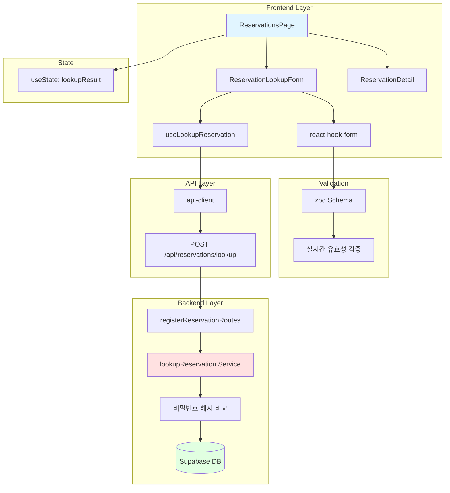

# Implementation Plan: 예약 조회 페이지

## 개요

예약 조회 페이지(`/reservations`)를 구현하기 위한 모듈 설계. 휴대폰번호와 비밀번호로 예약 내역을 조회합니다.

### 모듈 목록

| 모듈명 | 위치 | 설명 |
|--------|------|------|
| **Frontend** |
| ReservationsPage | `src/app/reservations/page.tsx` | 예약 조회 페이지 |
| ReservationLookupForm | `src/features/reservation/components/reservation-lookup-form.tsx` | 예약 조회 폼 |
| ReservationDetail | `src/features/reservation/components/reservation-detail.tsx` | 예약 상세 정보 표시 |
| useLookupReservation | `src/features/reservation/hooks/use-lookup-reservation.ts` | 예약 조회 Mutation 훅 |
| **Backend** |
| lookupReservation | `src/features/reservation/backend/service.ts` | 예약 조회 서비스 (추가) |
| LookupReservationSchema | `src/features/reservation/backend/schema.ts` | 요청 스키마 (추가) |
| **Shared** |
| validatePhoneNumber | `src/lib/utils.ts` | 휴대폰번호 검증 (재사용) |
| formatPhoneNumberInput | `src/lib/utils.ts` | 휴대폰번호 포맷 (재사용) |
| formatConcertDate | `src/lib/utils.ts` | 날짜 포맷 (재사용) |
| formatPrice | `src/lib/utils.ts` | 가격 포맷 (재사용) |

---

## Diagram



---

## Implementation Plan

### 1. Backend Implementation

#### 1.1 Schema Additions
**파일**: `src/features/reservation/backend/schema.ts`

기존 파일에 추가:
```typescript
export const LookupReservationSchema = z.object({
  phone_number: z
    .string()
    .regex(/^01\d{9,10}$/, '올바른 휴대폰 번호 형식이 아닙니다'),
  password: z
    .string()
    .regex(/^\d{4}$/, '비밀번호는 숫자 4자리여야 합니다'),
});

export const ReservationListResponseSchema = z.object({
  reservations: z.array(ReservationResponseSchema),
});

export type LookupReservationInput = z.infer<typeof LookupReservationSchema>;
export type ReservationListResponse = z.infer<typeof ReservationListResponseSchema>;
```

**충돌 여부**: ✅ 기존 파일 확장, 충돌 없음

#### 1.2 Service Layer Addition
**파일**: `src/features/reservation/backend/service.ts`

기존 파일에 추가:
```typescript
import bcrypt from 'bcryptjs';

export async function lookupReservation(
  supabase: SupabaseClient,
  input: LookupReservationInput
): Promise<Result<ReservationListResponse, ReservationServiceError>> {
  try {
    // 1. 휴대폰번호로 예약 목록 조회
    const { data: reservations, error } = await supabase
      .from('reservations')
      .select(`
        id,
        reservation_number,
        customer_name,
        phone_number,
        password_hash,
        total_amount,
        status,
        created_at,
        concerts!inner(
          name,
          date,
          venues!inner(name)
        ),
        reservation_seats!inner(
          seats!inner(section, row, column, grade)
        )
      `)
      .eq('phone_number', input.phone_number)
      .order('created_at', { ascending: false });

    if (error) {
      return failure(500, reservationErrorCodes.fetchError, error.message);
    }

    if (!reservations || reservations.length === 0) {
      return failure(404, reservationErrorCodes.notFound, '예약 정보를 찾을 수 없습니다');
    }

    // 2. 비밀번호 검증
    const validReservations = await Promise.all(
      reservations.map(async (reservation) => {
        const isPasswordValid = await bcrypt.compare(
          input.password,
          reservation.password_hash
        );
        return isPasswordValid ? reservation : null;
      })
    );

    const filteredReservations = validReservations.filter(
      (r): r is NonNullable<typeof r> => r !== null
    );

    if (filteredReservations.length === 0) {
      return failure(404, reservationErrorCodes.notFound, '예약 정보를 찾을 수 없습니다');
    }

    // 3. 응답 데이터 변환
    const response = filteredReservations.map((reservation) => ({
      reservation_number: reservation.reservation_number,
      customer_name: reservation.customer_name,
      phone_number: reservation.phone_number,
      total_amount: reservation.total_amount,
      created_at: reservation.created_at,
      concert: {
        name: reservation.concerts.name,
        date: reservation.concerts.date,
        venue_name: reservation.concerts.venues.name,
      },
      seats: reservation.reservation_seats.map((rs) => ({
        section: rs.seats.section,
        row: rs.seats.row,
        column: rs.seats.column,
        grade: rs.seats.grade,
      })),
    }));

    return success({ reservations: response });
  } catch (err) {
    return failure(
      500,
      reservationErrorCodes.fetchError,
      err instanceof Error ? err.message : 'Unknown error'
    );
  }
}
```

**충돌 여부**: ✅ 기존 파일에 함수 추가, 충돌 없음

**Unit Test**:
```typescript
describe('lookupReservation', () => {
  it('should return reservation with valid credentials', async () => {
    const input = {
      phone_number: '01012345678',
      password: '1234',
    };
    
    const result = await lookupReservation(mockSupabase, input);
    expect(result.ok).toBe(true);
    if (result.ok) {
      expect(result.data.reservations).toBeInstanceOf(Array);
      expect(result.data.reservations.length).toBeGreaterThan(0);
    }
  });

  it('should fail with invalid password', async () => {
    const input = {
      phone_number: '01012345678',
      password: 'wrong',
    };
    
    const result = await lookupReservation(mockSupabase, input);
    expect(result.ok).toBe(false);
    if (!result.ok) {
      expect(result.error.code).toBe(reservationErrorCodes.notFound);
    }
  });

  it('should fail with non-existent phone number', async () => {
    const input = {
      phone_number: '01099999999',
      password: '1234',
    };
    
    const result = await lookupReservation(mockSupabase, input);
    expect(result.ok).toBe(false);
  });

  it('should return multiple reservations if exists', async () => {
    const result = await lookupReservation(mockSupabase, validInput);
    if (result.ok && result.data.reservations.length > 1) {
      // 최신순 정렬 확인
      const dates = result.data.reservations.map(r => new Date(r.created_at));
      expect(dates[0] >= dates[1]).toBe(true);
    }
  });
});
```

#### 1.3 Route Handler Addition
**파일**: `src/features/reservation/backend/route.ts`

기존 파일에 추가:
```typescript
import { LookupReservationSchema } from './schema';
import { lookupReservation } from './service';

// registerReservationRoutes 함수 내에 추가
app.post('/reservations/lookup', async (c) => {
  const body = await c.req.json();
  const parsedBody = LookupReservationSchema.safeParse(body);

  if (!parsedBody.success) {
    return respond(
      c,
      failure(
        400,
        reservationErrorCodes.invalidParams,
        'Invalid request body',
        parsedBody.error.format()
      )
    );
  }

  const supabase = getSupabase(c);
  const logger = getLogger(c);

  const result = await lookupReservation(supabase, parsedBody.data);

  if (!result.ok) {
    logger.error('Failed to lookup reservation', result.error.message);
  }

  return respond(c, result);
});
```

**충돌 여부**: ✅ 기존 라우터에 엔드포인트 추가, 충돌 없음

---

### 2. Frontend Implementation

#### 2.1 DTO Type Addition
**파일**: `src/features/reservation/lib/dto.ts`

기존 파일에 추가:
```typescript
export type {
  CreateReservationInput,
  ReservationResponse,
  LookupReservationInput,
  ReservationListResponse,
} from '../backend/schema';
```

**충돌 여부**: ✅ 기존 파일 확장, 충돌 없음

#### 2.2 React Query Mutation Hook
**파일**: `src/features/reservation/hooks/use-lookup-reservation.ts`

```typescript
import { useMutation } from '@tanstack/react-query';
import { apiClient } from '@/lib/remote/api-client';
import type { LookupReservationInput, ReservationListResponse } from '../lib/dto';

export function useLookupReservation() {
  return useMutation({
    mutationFn: async (input: LookupReservationInput) => {
      const response = await apiClient.post<ReservationListResponse>(
        '/api/reservations/lookup',
        input
      );
      return response.data;
    },
  });
}
```

**충돌 여부**: ✅ 신규 훅, 충돌 없음

#### 2.3 ReservationLookupForm Component
**파일**: `src/features/reservation/components/reservation-lookup-form.tsx`

```typescript
'use client';

import { useForm } from 'react-hook-form';
import { zodResolver } from '@hookform/resolvers/zod';
import { Loader2 } from 'lucide-react';
import { Button } from '@/components/ui/button';
import {
  Form,
  FormControl,
  FormDescription,
  FormField,
  FormItem,
  FormLabel,
  FormMessage,
} from '@/components/ui/form';
import { Input } from '@/components/ui/input';
import { LookupReservationSchema } from '../backend/schema';
import { useLookupReservation } from '../hooks/use-lookup-reservation';
import { formatPhoneNumberInput } from '@/lib/utils';
import type { LookupReservationInput } from '../lib/dto';

interface ReservationLookupFormProps {
  onSuccess: (data: ReservationListResponse) => void;
}

export function ReservationLookupForm({ onSuccess }: ReservationLookupFormProps) {
  const mutation = useLookupReservation();

  const form = useForm<LookupReservationInput>({
    resolver: zodResolver(LookupReservationSchema),
    defaultValues: {
      phone_number: '',
      password: '',
    },
  });

  const onSubmit = (data: LookupReservationInput) => {
    mutation.mutate(data, {
      onSuccess: (result) => {
        onSuccess(result);
        form.reset();
      },
    });
  };

  return (
    <Form {...form}>
      <form onSubmit={form.handleSubmit(onSubmit)} className="space-y-6">
        <FormField
          control={form.control}
          name="phone_number"
          render={({ field }) => (
            <FormItem>
              <FormLabel>휴대폰번호 *</FormLabel>
              <FormControl>
                <Input
                  placeholder="01012345678"
                  {...field}
                  onChange={(e) => {
                    const formatted = formatPhoneNumberInput(e.target.value);
                    field.onChange(formatted);
                  }}
                  maxLength={11}
                />
              </FormControl>
              <FormDescription>예) 01012345678 (하이픈 없이)</FormDescription>
              <FormMessage />
            </FormItem>
          )}
        />

        <FormField
          control={form.control}
          name="password"
          render={({ field }) => (
            <FormItem>
              <FormLabel>비밀번호 (4자리) *</FormLabel>
              <FormControl>
                <Input
                  type="password"
                  placeholder="1234"
                  {...field}
                  onChange={(e) => {
                    const formatted = formatPhoneNumberInput(e.target.value);
                    field.onChange(formatted);
                  }}
                  maxLength={4}
                />
              </FormControl>
              <FormDescription>예약 시 입력한 비밀번호를 입력해주세요.</FormDescription>
              <FormMessage />
            </FormItem>
          )}
        />

        {mutation.isError && (
          <div className="p-3 bg-destructive/10 text-destructive rounded-md text-sm">
            {mutation.error instanceof Error && mutation.error.message.includes('404')
              ? '예약 정보를 찾을 수 없습니다. 휴대폰번호와 비밀번호를 확인해주세요.'
              : '조회에 실패했습니다. 다시 시도해주세요.'}
          </div>
        )}

        <Button
          type="submit"
          disabled={mutation.isPending}
          className="w-full"
          size="lg"
        >
          {mutation.isPending && (
            <Loader2 className="w-4 h-4 mr-2 animate-spin" />
          )}
          조회하기
        </Button>
      </form>
    </Form>
  );
}
```

**충돌 여부**: ✅ 신규 컴포넌트, 충돌 없음

**QA Sheet**:
- [ ] 필수 필드 검증
- [ ] 휴대폰번호 자동 포맷 (숫자만)
- [ ] 비밀번호 자동 포맷 (숫자만, 4자리)
- [ ] 실시간 유효성 검증
- [ ] 제출 중 버튼 비활성화 및 로딩
- [ ] 에러 시 사용자 친화적 메시지
- [ ] 조회 성공 시 콜백 실행

#### 2.4 ReservationDetail Component
**파일**: `src/features/reservation/components/reservation-detail.tsx`

```typescript
'use client';

import { Calendar, MapPin, User, Phone, CreditCard, Hash } from 'lucide-react';
import { Card, CardContent, CardHeader, CardTitle } from '@/components/ui/card';
import { Badge } from '@/components/ui/badge';
import { Separator } from '@/components/ui/separator';
import { formatConcertDate, formatPrice } from '@/lib/utils';
import { format } from 'date-fns';
import { ko } from 'date-fns/locale';
import type { ReservationResponse } from '../lib/dto';

interface ReservationDetailProps {
  reservations: ReservationResponse[];
}

const gradeLabels = {
  SPECIAL: 'Special',
  PREMIUM: 'Premium',
  ADVANCED: 'Advanced',
  REGULAR: 'Regular',
};

export function ReservationDetail({ reservations }: ReservationDetailProps) {
  if (reservations.length === 0) {
    return null;
  }

  return (
    <div className="space-y-6">
      <div className="flex items-center justify-between">
        <h2 className="text-2xl font-bold">예약 내역</h2>
        <Badge variant="secondary">{reservations.length}건</Badge>
      </div>

      {reservations.map((reservation) => {
        const reservedAt = format(
          new Date(reservation.created_at),
          'yyyy년 MM월 dd일 HH:mm',
          { locale: ko }
        );

        return (
          <Card key={reservation.reservation_number}>
            <CardHeader>
              <div className="flex items-center justify-between">
                <CardTitle>예약 번호</CardTitle>
                <span className="text-lg font-bold text-primary">
                  {reservation.reservation_number}
                </span>
              </div>
            </CardHeader>
            <CardContent className="space-y-4">
              {/* 콘서트 정보 */}
              <div className="space-y-2">
                <h3 className="font-semibold flex items-center gap-2">
                  <Calendar className="w-4 h-4" />
                  콘서트 정보
                </h3>
                <div className="ml-6 space-y-1">
                  <p className="font-medium">{reservation.concert.name}</p>
                  <p className="text-sm text-muted-foreground">
                    {formatConcertDate(reservation.concert.date)}
                  </p>
                  <div className="flex items-center gap-2 text-sm text-muted-foreground">
                    <MapPin className="w-4 h-4" />
                    <span>{reservation.concert.venue_name}</span>
                  </div>
                </div>
              </div>

              <Separator />

              {/* 예약 좌석 */}
              <div className="space-y-2">
                <h3 className="font-semibold">
                  예약된 좌석 ({reservation.seats.length}석)
                </h3>
                <div className="grid grid-cols-2 sm:grid-cols-3 gap-2">
                  {reservation.seats.map((seat, index) => (
                    <div
                      key={index}
                      className="flex items-center justify-between p-2 bg-muted rounded text-sm"
                    >
                      <span>
                        {seat.section}구역 {seat.row}행 {seat.column}열
                      </span>
                      <Badge variant="outline" className="text-xs">
                        {gradeLabels[seat.grade]}
                      </Badge>
                    </div>
                  ))}
                </div>
              </div>

              <Separator />

              {/* 예약자 정보 */}
              <div className="space-y-2">
                <h3 className="font-semibold">예약자 정보</h3>
                <div className="ml-6 space-y-1 text-sm">
                  <div className="flex items-center gap-2">
                    <User className="w-4 h-4 text-muted-foreground" />
                    <span>{reservation.customer_name}</span>
                  </div>
                  <div className="flex items-center gap-2">
                    <Phone className="w-4 h-4 text-muted-foreground" />
                    <span>{reservation.phone_number}</span>
                  </div>
                  <div className="flex items-center gap-2">
                    <Hash className="w-4 h-4 text-muted-foreground" />
                    <span className="text-muted-foreground">예약일시: {reservedAt}</span>
                  </div>
                </div>
              </div>

              <Separator />

              {/* 결제 금액 */}
              <div className="flex items-center justify-between p-3 bg-primary/5 rounded-lg">
                <div className="flex items-center gap-2">
                  <CreditCard className="w-5 h-5" />
                  <span className="font-semibold">총 결제 금액</span>
                </div>
                <span className="text-xl font-bold text-primary">
                  {formatPrice(reservation.total_amount)}
                </span>
              </div>
            </CardContent>
          </Card>
        );
      })}
    </div>
  );
}
```

**충돌 여부**: ✅ 신규 컴포넌트, 충돌 없음

**QA Sheet**:
- [ ] 여러 예약이 있을 때 모두 표시
- [ ] 예약 건수 표시
- [ ] 각 예약의 전체 정보 표시
- [ ] 좌석 정보 그리드 레이아웃
- [ ] 날짜 포맷 (예약일시)
- [ ] 반응형 디자인

#### 2.5 Page Component
**파일**: `src/app/reservations/page.tsx`

```typescript
'use client';

import { useState } from 'react';
import { ReservationLookupForm } from '@/features/reservation/components/reservation-lookup-form';
import { ReservationDetail } from '@/features/reservation/components/reservation-detail';
import type { ReservationListResponse } from '@/features/reservation/lib/dto';

export default function ReservationsPage() {
  const [lookupResult, setLookupResult] = useState<ReservationListResponse | null>(null);

  return (
    <div className="container mx-auto px-4 py-8 max-w-4xl">
      <h1 className="text-3xl font-bold mb-8">예약 조회</h1>

      <div className="space-y-8">
        {/* 조회 폼 */}
        <div className="bg-card border rounded-lg p-6">
          <ReservationLookupForm onSuccess={setLookupResult} />
        </div>

        {/* 조회 결과 */}
        {lookupResult && (
          <ReservationDetail reservations={lookupResult.reservations} />
        )}
      </div>
    </div>
  );
}
```

**충돌 여부**: ✅ 신규 페이지, 충돌 없음

**QA Sheet**:
- [ ] 조회 폼 표시
- [ ] 조회 성공 시 결과 표시
- [ ] 조회 전에는 결과 미표시
- [ ] 최대 너비 제한 (max-w-4xl)
- [ ] 폼과 결과 사이 간격

---

### 3. Required Dependencies

모든 필요한 패키지는 이미 설치되어 있음:
- `react-hook-form`
- `@hookform/resolvers`
- `bcryptjs` (설치 필요 확인)

```bash
$ npm install bcryptjs
$ npm install -D @types/bcryptjs
```

**충돌 여부**: ⚠️ bcryptjs 설치 필요 여부 확인

---

### 4. Implementation Steps

1. **Backend Implementation**
   - [ ] schema.ts에 조회 스키마 추가
   - [ ] service.ts에 lookupReservation 추가
   - [ ] unit test 작성 및 실행
   - [ ] route.ts에 엔드포인트 추가
   - [ ] bcryptjs 설치 확인

2. **Frontend Implementation**
   - [ ] dto.ts에 타입 export 추가
   - [ ] use-lookup-reservation.ts 훅 작성
   - [ ] reservation-lookup-form.tsx 컴포넌트
   - [ ] reservation-detail.tsx 컴포넌트
   - [ ] page.tsx 페이지

3. **Testing & QA**
   - [ ] Backend unit test 실행
   - [ ] 비밀번호 해시 비교 로직 검증
   - [ ] Frontend QA sheet 확인
   - [ ] 여러 예약 표시 테스트
   - [ ] 보안 테스트 (구체적 에러 노출 방지)

---

### 5. Edge Cases & Solutions

| 엣지케이스 | 대응 방안 |
|-----------|----------|
| 존재하지 않는 휴대폰번호 | 404 에러, 안내 메시지 (구체적 정보 노출 최소화) |
| 비밀번호 불일치 | 404 에러, 동일한 안내 메시지 (보안) |
| 여러 예약 존재 | 모두 표시, 최신순 정렬 |
| 취소된 예약 | 조회 결과에서 제외 (status='CONFIRMED'만) |
| 과거 콘서트 예약 | 정상 표시, 종료 여부 표시 고려 |
| 필수 필드 미입력 | 버튼 비활성화 또는 검증 에러 |
| API 요청 중 오류 | 에러 메시지 표시 |

---

### 6. Shared Modules (DRY)

| 모듈 | 재사용처 |
|------|---------|
| `validatePhoneNumber` | 예약 정보 입력 |
| `formatPhoneNumberInput` | 예약 정보 입력 |
| `LookupReservationSchema` | 백엔드 검증 |
| `ReservationResponse` 타입 | 예약 완료 |
| `formatConcertDate` | 모든 페이지 |
| `formatPrice` | 모든 페이지 |

---

### 7. Security Considerations

- ✅ 비밀번호는 bcrypt 해시로 저장 및 비교
- ✅ 조회 실패 시 구체적인 실패 원인 노출하지 않음 (보안)
- ✅ 취소된 예약은 조회 결과에서 제외
- ✅ SQL Injection 방지 (Supabase 파라미터 바인딩)
- ✅ Rate limiting 고려 (향후 구현)

---

**작성일**: 2025-10-15

