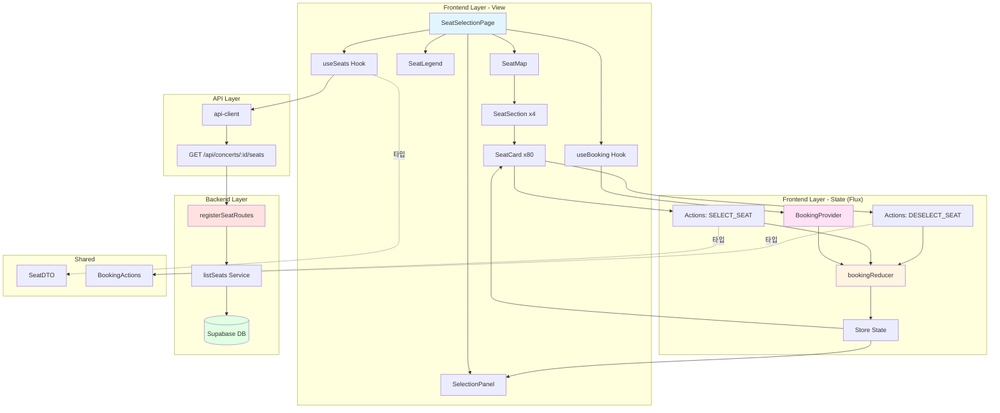

# Implementation Plan: 좌석 선택 페이지

## 개요

좌석 선택 페이지(`/concerts/[id]/seats`)를 구현하기 위한 모듈 설계. BookingContext와 연동하여 Flux 아키텍처 패턴을 적용합니다.

### 모듈 목록

| 모듈명 | 위치 | 설명 |
|--------|------|------|
| **Frontend - Presentation** |
| SeatSelectionPage | `src/app/concerts/[id]/seats/page.tsx` | 좌석 선택 페이지 컴포넌트 |
| SeatMap | `src/features/seat/components/seat-map.tsx` | 좌석 맵 컨테이너 |
| SeatSection | `src/features/seat/components/seat-section.tsx` | 구역별 좌석 그룹 |
| SeatCard | `src/features/seat/components/seat-card.tsx` | 개별 좌석 카드 |
| SeatLegend | `src/features/seat/components/seat-legend.tsx` | 좌석 등급 범례 |
| SelectionPanel | `src/features/seat/components/selection-panel.tsx` | 선택 정보 패널 |
| useSeats | `src/features/seat/hooks/use-seats.ts` | 좌석 현황 조회 React Query 훅 |
| **Frontend - State** |
| BookingProvider | `src/features/booking/context/booking-provider.tsx` | Booking Context Provider |
| bookingReducer | `src/features/booking/context/booking-reducer.ts` | Booking Reducer |
| useBooking | `src/features/booking/context/use-booking.ts` | Booking Context Hook |
| **Backend** |
| listSeats | `src/features/seat/backend/service.ts` | 좌석 목록 조회 서비스 |
| registerSeatRoutes | `src/features/seat/backend/route.ts` | 좌석 관련 API 라우터 |
| SeatListResponseSchema | `src/features/seat/backend/schema.ts` | 응답 스키마 정의 |
| seatErrorCodes | `src/features/seat/backend/error.ts` | 에러 코드 정의 |
| **Shared** |
| SeatDTO | `src/features/seat/lib/dto.ts` | 클라이언트 측 타입 재노출 |
| BookingActions | `src/features/booking/constants/actions.ts` | Flux 액션 타입 상수 |
| **Database** |
| seats | `supabase/migrations/0004_create_seats_table.sql` | 좌석 테이블 |

---

## Diagram



---

## Implementation Plan

### 1. Database Migration

**파일**: `supabase/migrations/0004_create_seats_table.sql`

```sql
-- seats 테이블
CREATE TYPE seat_status_type AS ENUM ('AVAILABLE', 'RESERVED');
CREATE TYPE section_type AS ENUM ('A', 'B', 'C', 'D');

CREATE TABLE IF NOT EXISTS seats (
  id UUID PRIMARY KEY DEFAULT gen_random_uuid(),
  concert_id UUID NOT NULL REFERENCES concerts(id) ON DELETE CASCADE,
  section section_type NOT NULL,
  row INTEGER NOT NULL CHECK (row >= 1 AND row <= 4),
  "column" INTEGER NOT NULL CHECK ("column" >= 1 AND "column" <= 20),
  grade seat_grade_type NOT NULL,
  status seat_status_type NOT NULL DEFAULT 'AVAILABLE',
  created_at TIMESTAMP WITH TIME ZONE DEFAULT CURRENT_TIMESTAMP,
  updated_at TIMESTAMP WITH TIME ZONE DEFAULT CURRENT_TIMESTAMP,
  CONSTRAINT seats_concert_position_unique UNIQUE(concert_id, section, row, "column")
);

CREATE INDEX idx_seats_concert ON seats(concert_id);
CREATE INDEX idx_seats_status ON seats(concert_id, status);
CREATE INDEX idx_seats_grade ON seats(concert_id, grade);

CREATE TRIGGER update_seats_updated_at
  BEFORE UPDATE ON seats
  FOR EACH ROW
  EXECUTE FUNCTION update_updated_at_column();

ALTER TABLE seats DISABLE ROW LEVEL SECURITY;

-- 좌석 자동 생성 함수
CREATE OR REPLACE FUNCTION generate_seats_for_concert(p_concert_id UUID)
RETURNS VOID AS $$
DECLARE
  v_section section_type;
  v_row INTEGER;
  v_column INTEGER;
  v_grade seat_grade_type;
BEGIN
  FOREACH v_section IN ARRAY ARRAY['A', 'B', 'C', 'D']::section_type[] LOOP
    FOR v_row IN 1..4 LOOP
      FOR v_column IN 1..20 LOOP
        IF v_column BETWEEN 1 AND 3 THEN
          v_grade := 'SPECIAL';
        ELSIF v_column BETWEEN 4 AND 7 THEN
          v_grade := 'PREMIUM';
        ELSIF v_column BETWEEN 8 AND 15 THEN
          v_grade := 'ADVANCED';
        ELSE
          v_grade := 'REGULAR';
        END IF;
        
        INSERT INTO seats (concert_id, section, row, "column", grade, status)
        VALUES (p_concert_id, v_section, v_row, v_column, v_grade, 'AVAILABLE');
      END LOOP;
    END LOOP;
  END LOOP;
END;
$$ LANGUAGE plpgsql;
```

**충돌 여부**: ✅ 신규 마이그레이션, 충돌 없음

---

### 2. Backend Implementation

#### 2.1 Error Codes
**파일**: `src/features/seat/backend/error.ts`

```typescript
export const seatErrorCodes = {
  fetchError: 'SEAT_FETCH_ERROR',
  notFound: 'SEAT_NOT_FOUND',
  invalidParams: 'SEAT_INVALID_PARAMS',
} as const;

export type SeatServiceError =
  | { code: typeof seatErrorCodes.fetchError; message: string }
  | { code: typeof seatErrorCodes.notFound; message: string }
  | { code: typeof seatErrorCodes.invalidParams; message: string };
```

**충돌 여부**: ✅ 신규 feature, 충돌 없음

#### 2.2 Schema Definitions
**파일**: `src/features/seat/backend/schema.ts`

```typescript
import { z } from 'zod';

export const SeatSchema = z.object({
  id: z.string().uuid(),
  section: z.enum(['A', 'B', 'C', 'D']),
  row: z.number().int().min(1).max(4),
  column: z.number().int().min(1).max(20),
  grade: z.enum(['SPECIAL', 'PREMIUM', 'ADVANCED', 'REGULAR']),
  status: z.enum(['AVAILABLE', 'RESERVED']),
  price: z.number().int().positive(),
});

export const SeatListResponseSchema = z.object({
  seats: z.array(SeatSchema),
});

export const SeatParamsSchema = z.object({
  concertId: z.string().uuid('Invalid concert ID format'),
});

export type Seat = z.infer<typeof SeatSchema>;
export type SeatListResponse = z.infer<typeof SeatListResponseSchema>;
export type SeatParams = z.infer<typeof SeatParamsSchema>;
```

**충돌 여부**: ✅ 신규 스키마, 충돌 없음

#### 2.3 Service Layer
**파일**: `src/features/seat/backend/service.ts`

```typescript
import type { SupabaseClient } from '@supabase/supabase-js';
import { failure, success, type Result } from '@/backend/http/response';
import { seatErrorCodes, type SeatServiceError } from './error';
import type { SeatListResponse } from './schema';

export async function listSeats(
  supabase: SupabaseClient,
  concertId: string
): Promise<Result<SeatListResponse, SeatServiceError>> {
  try {
    // 좌석 조회
    const { data: seats, error: seatsError } = await supabase
      .from('seats')
      .select('id, section, row, column, grade, status')
      .eq('concert_id', concertId)
      .order('section', { ascending: true })
      .order('row', { ascending: true })
      .order('column', { ascending: true });

    if (seatsError) {
      return failure(500, seatErrorCodes.fetchError, seatsError.message);
    }

    // 가격 정보 조회
    const { data: concert, error: concertError } = await supabase
      .from('concerts')
      .select('venue_id')
      .eq('id', concertId)
      .single();

    if (concertError || !concert) {
      return failure(404, seatErrorCodes.notFound, 'Concert not found');
    }

    const { data: grades, error: gradesError } = await supabase
      .from('seat_grades')
      .select('name, price')
      .eq('venue_id', concert.venue_id);

    if (gradesError) {
      return failure(500, seatErrorCodes.fetchError, gradesError.message);
    }

    // 좌석에 가격 정보 추가
    const priceMap = new Map(grades.map((g) => [g.name, g.price]));
    const seatsWithPrice = seats.map((seat) => ({
      ...seat,
      price: priceMap.get(seat.grade) || 0,
    }));

    return success({ seats: seatsWithPrice });
  } catch (err) {
    return failure(
      500,
      seatErrorCodes.fetchError,
      err instanceof Error ? err.message : 'Unknown error'
    );
  }
}
```

**충돌 여부**: ✅ 신규 서비스, 충돌 없음

**Unit Test**:
```typescript
describe('listSeats', () => {
  it('should return 320 seats for a concert', async () => {
    const result = await listSeats(mockSupabase, 'concert-id-123');
    expect(result.ok).toBe(true);
    if (result.ok) {
      expect(result.data.seats).toHaveLength(320);
    }
  });

  it('should include price information', async () => {
    const result = await listSeats(mockSupabase, 'concert-id-123');
    if (result.ok) {
      result.data.seats.forEach((seat) => {
        expect(seat.price).toBeGreaterThan(0);
      });
    }
  });

  it('should order seats by section, row, column', async () => {
    const result = await listSeats(mockSupabase, 'concert-id-123');
    if (result.ok) {
      const firstSeat = result.data.seats[0];
      expect(firstSeat.section).toBe('A');
      expect(firstSeat.row).toBe(1);
      expect(firstSeat.column).toBe(1);
    }
  });

  it('should return 404 for non-existent concert', async () => {
    const result = await listSeats(mockSupabase, 'non-existent-id');
    expect(result.ok).toBe(false);
    if (!result.ok) {
      expect(result.error.code).toBe(seatErrorCodes.notFound);
    }
  });
});
```

#### 2.4 Route Handler
**파일**: `src/features/seat/backend/route.ts`

```typescript
import type { Hono } from 'hono';
import { respond, failure } from '@/backend/http/response';
import { getLogger, getSupabase, type AppEnv } from '@/backend/hono/context';
import { SeatParamsSchema } from './schema';
import { listSeats } from './service';
import { seatErrorCodes } from './error';

export const registerSeatRoutes = (app: Hono<AppEnv>) => {
  app.get('/concerts/:concertId/seats', async (c) => {
    const parsedParams = SeatParamsSchema.safeParse({
      concertId: c.req.param('concertId'),
    });

    if (!parsedParams.success) {
      return respond(
        c,
        failure(
          400,
          seatErrorCodes.invalidParams,
          'Invalid concert ID',
          parsedParams.error.format()
        )
      );
    }

    const supabase = getSupabase(c);
    const logger = getLogger(c);

    const result = await listSeats(supabase, parsedParams.data.concertId);

    if (!result.ok) {
      logger.error('Failed to fetch seats', result.error.message);
    }

    return respond(c, result);
  });
};
```

**충돌 여부**: ✅ 신규 라우터, app.ts에 등록 필요

#### 2.5 Hono App Registration
**파일**: `src/backend/hono/app.ts`

기존 코드에 추가:
```typescript
import { registerSeatRoutes } from '@/features/seat/backend/route';

// createHonoApp 함수 내
registerSeatRoutes(app);
```

**충돌 여부**: ✅ 기존 패턴 따름, 충돌 없음

---

### 3. State Management (Flux Architecture)

#### 3.1 Action Types
**파일**: `src/features/booking/constants/actions.ts`

```typescript
export const BOOKING_ACTIONS = {
  SET_CONCERT: 'SET_CONCERT',
  SELECT_SEAT: 'SELECT_SEAT',
  DESELECT_SEAT: 'DESELECT_SEAT',
  CLEAR_SELECTION: 'CLEAR_SELECTION',
} as const;

export type BookingActionType = typeof BOOKING_ACTIONS[keyof typeof BOOKING_ACTIONS];
```

**충돌 여부**: ✅ 신규 파일, 충돌 없음

#### 3.2 Booking Types
**파일**: `src/features/booking/types.ts`

```typescript
import type { Seat } from '@/features/seat/lib/dto';

export interface BookingState {
  selectedConcertId: string | null;
  selectedSeats: Seat[];
  totalAmount: number;
}

export type BookingAction =
  | { type: 'SET_CONCERT'; payload: { concertId: string } }
  | { type: 'SELECT_SEAT'; payload: { seat: Seat } }
  | { type: 'DESELECT_SEAT'; payload: { seatId: string } }
  | { type: 'CLEAR_SELECTION' };

export interface BookingContextValue {
  state: BookingState;
  actions: {
    setConcert: (concertId: string) => void;
    selectSeat: (seat: Seat) => void;
    deselectSeat: (seatId: string) => void;
    clearSelection: () => void;
  };
}
```

**충돌 여부**: ✅ 신규 파일, 충돌 없음

#### 3.3 Reducer
**파일**: `src/features/booking/context/booking-reducer.ts`

```typescript
import type { BookingState, BookingAction } from '../types';

export const initialBookingState: BookingState = {
  selectedConcertId: null,
  selectedSeats: [],
  totalAmount: 0,
};

export function bookingReducer(
  state: BookingState,
  action: BookingAction
): BookingState {
  switch (action.type) {
    case 'SET_CONCERT':
      return {
        ...state,
        selectedConcertId: action.payload.concertId,
      };

    case 'SELECT_SEAT': {
      const { seat } = action.payload;
      
      // 중복 선택 방지
      if (state.selectedSeats.some((s) => s.id === seat.id)) {
        return state;
      }

      const newSeats = [...state.selectedSeats, seat];
      const newTotal = newSeats.reduce((sum, s) => sum + s.price, 0);

      return {
        ...state,
        selectedSeats: newSeats,
        totalAmount: newTotal,
      };
    }

    case 'DESELECT_SEAT': {
      const { seatId } = action.payload;
      const newSeats = state.selectedSeats.filter((s) => s.id !== seatId);
      const newTotal = newSeats.reduce((sum, s) => sum + s.price, 0);

      return {
        ...state,
        selectedSeats: newSeats,
        totalAmount: newTotal,
      };
    }

    case 'CLEAR_SELECTION':
      return initialBookingState;

    default:
      return state;
  }
}
```

**충돌 여부**: ✅ 신규 파일, 충돌 없음

**Unit Test**:
```typescript
describe('bookingReducer', () => {
  it('should add seat to selectedSeats', () => {
    const state = initialBookingState;
    const seat = mockSeat({ id: 'seat-1', price: 250000 });
    
    const newState = bookingReducer(state, {
      type: 'SELECT_SEAT',
      payload: { seat },
    });
    
    expect(newState.selectedSeats).toHaveLength(1);
    expect(newState.totalAmount).toBe(250000);
  });

  it('should prevent duplicate seat selection', () => {
    const seat = mockSeat({ id: 'seat-1', price: 250000 });
    const state = { ...initialBookingState, selectedSeats: [seat], totalAmount: 250000 };
    
    const newState = bookingReducer(state, {
      type: 'SELECT_SEAT',
      payload: { seat },
    });
    
    expect(newState.selectedSeats).toHaveLength(1);
  });

  it('should remove seat from selectedSeats', () => {
    const seat = mockSeat({ id: 'seat-1', price: 250000 });
    const state = { ...initialBookingState, selectedSeats: [seat], totalAmount: 250000 };
    
    const newState = bookingReducer(state, {
      type: 'DESELECT_SEAT',
      payload: { seatId: 'seat-1' },
    });
    
    expect(newState.selectedSeats).toHaveLength(0);
    expect(newState.totalAmount).toBe(0);
  });
});
```

#### 3.4 Provider
**파일**: `src/features/booking/context/booking-provider.tsx`

```typescript
'use client';

import { createContext, useReducer, useMemo, type ReactNode } from 'react';
import { bookingReducer, initialBookingState } from './booking-reducer';
import type { BookingContextValue } from '../types';

export const BookingContext = createContext<BookingContextValue | undefined>(
  undefined
);

interface BookingProviderProps {
  children: ReactNode;
}

export function BookingProvider({ children }: BookingProviderProps) {
  const [state, dispatch] = useReducer(bookingReducer, initialBookingState);

  const actions = useMemo(
    () => ({
      setConcert: (concertId: string) => {
        dispatch({ type: 'SET_CONCERT', payload: { concertId } });
      },
      selectSeat: (seat: Seat) => {
        dispatch({ type: 'SELECT_SEAT', payload: { seat } });
      },
      deselectSeat: (seatId: string) => {
        dispatch({ type: 'DESELECT_SEAT', payload: { seatId } });
      },
      clearSelection: () => {
        dispatch({ type: 'CLEAR_SELECTION' });
      },
    }),
    []
  );

  const value = useMemo(() => ({ state, actions }), [state, actions]);

  return (
    <BookingContext.Provider value={value}>
      {children}
    </BookingContext.Provider>
  );
}
```

**충돌 여부**: ✅ 신규 파일, 충돌 없음

#### 3.5 Hook
**파일**: `src/features/booking/context/use-booking.ts`

```typescript
import { useContext } from 'react';
import { BookingContext } from './booking-provider';

export function useBooking() {
  const context = useContext(BookingContext);
  
  if (!context) {
    throw new Error('useBooking must be used within BookingProvider');
  }
  
  return context;
}
```

**충돌 여부**: ✅ 신규 파일, 충돌 없음

#### 3.6 App Layout Update
**파일**: `src/app/providers.tsx`

기존 파일에 추가:
```typescript
import { BookingProvider } from '@/features/booking/context/booking-provider';

export function Providers({ children }: { children: ReactNode }) {
  return (
    <QueryClientProvider client={queryClient}>
      <BookingProvider>
        {children}
      </BookingProvider>
    </QueryClientProvider>
  );
}
```

**충돌 여부**: ⚠️ 기존 providers.tsx 확인 필요, QueryClientProvider 이미 존재 가능

---

### 4. Frontend Implementation

#### 4.1 DTO Types
**파일**: `src/features/seat/lib/dto.ts`

```typescript
export type { Seat, SeatListResponse } from '../backend/schema';
```

**충돌 여부**: ✅ 신규 파일, 충돌 없음

#### 4.2 React Query Hook
**파일**: `src/features/seat/hooks/use-seats.ts`

```typescript
import { useQuery } from '@tanstack/react-query';
import { apiClient } from '@/lib/remote/api-client';
import type { SeatListResponse } from '../lib/dto';

export function useSeats(concertId: string) {
  return useQuery({
    queryKey: ['seats', concertId],
    queryFn: async () => {
      const response = await apiClient.get<SeatListResponse>(
        `/api/concerts/${concertId}/seats`
      );
      return response.data;
    },
    enabled: !!concertId,
    staleTime: 1000 * 60 * 2, // 2분 (좌석은 자주 변경될 수 있음)
    refetchInterval: 1000 * 30, // 30초마다 자동 리패치
  });
}
```

**충돌 여부**: ✅ 신규 훅, 충돌 없음

#### 4.3 SeatCard Component
**파일**: `src/features/seat/components/seat-card.tsx`

```typescript
'use client';

import { cn } from '@/lib/utils';
import { useBooking } from '@/features/booking/context/use-booking';
import type { Seat } from '../lib/dto';

interface SeatCardProps {
  seat: Seat;
}

const gradeColors = {
  SPECIAL: 'bg-yellow-100 hover:bg-yellow-200 border-yellow-500',
  PREMIUM: 'bg-blue-100 hover:bg-blue-200 border-blue-500',
  ADVANCED: 'bg-green-100 hover:bg-green-200 border-green-500',
  REGULAR: 'bg-gray-100 hover:bg-gray-200 border-gray-500',
};

export function SeatCard({ seat }: SeatCardProps) {
  const { state, actions } = useBooking();
  
  const isSelected = state.selectedSeats.some((s) => s.id === seat.id);
  const isReserved = seat.status === 'RESERVED';
  
  const handleClick = () => {
    if (isReserved) return;
    
    if (isSelected) {
      actions.deselectSeat(seat.id);
    } else {
      actions.selectSeat(seat);
    }
  };
  
  return (
    <button
      onClick={handleClick}
      disabled={isReserved}
      className={cn(
        'w-8 h-8 text-xs font-medium border-2 rounded transition-colors',
        isReserved && 'bg-gray-300 cursor-not-allowed border-gray-400',
        !isReserved && gradeColors[seat.grade],
        isSelected && 'ring-2 ring-primary ring-offset-1'
      )}
      title={`${seat.section}구역 ${seat.row}행 ${seat.column}열`}
    >
      {seat.column}
    </button>
  );
}
```

**충돌 여부**: ✅ 신규 컴포넌트, 충돌 없음

**QA Sheet**:
- [ ] 등급별 색상 표시
- [ ] 선택된 좌석 ring 효과
- [ ] 예약된 좌석 비활성화 및 회색 표시
- [ ] 클릭 시 선택/해제 토글
- [ ] 툴팁으로 좌석 정보 표시

#### 4.4 SeatSection Component
**파일**: `src/features/seat/components/seat-section.tsx`

```typescript
'use client';

import { SeatCard } from './seat-card';
import type { Seat } from '../lib/dto';

interface SeatSectionProps {
  section: 'A' | 'B' | 'C' | 'D';
  seats: Seat[];
}

export function SeatSection({ section, seats }: SeatSectionProps) {
  // 행별로 좌석 그룹화
  const seatsByRow = seats.reduce((acc, seat) => {
    if (!acc[seat.row]) {
      acc[seat.row] = [];
    }
    acc[seat.row].push(seat);
    return acc;
  }, {} as Record<number, Seat[]>);

  return (
    <div className="space-y-2">
      <div className="text-center font-bold text-lg mb-2">{section}구역</div>
      <div className="space-y-1">
        {[1, 2, 3, 4].map((row) => (
          <div key={row} className="flex gap-1 items-center">
            <span className="text-xs text-muted-foreground w-6">{row}행</span>
            <div className="flex gap-0.5">
              {seatsByRow[row]?.map((seat) => (
                <SeatCard key={seat.id} seat={seat} />
              ))}
            </div>
          </div>
        ))}
      </div>
    </div>
  );
}
```

**충돌 여부**: ✅ 신규 컴포넌트, 충돌 없음

**QA Sheet**:
- [ ] 구역명 표시
- [ ] 행별로 좌석 정렬
- [ ] 각 행에 행 번호 표시
- [ ] 좌석 간 간격 일정

#### 4.5 SeatMap Component
**파일**: `src/features/seat/components/seat-map.tsx`

```typescript
'use client';

import { SeatSection } from './seat-section';
import type { Seat } from '../lib/dto';

interface SeatMapProps {
  seats: Seat[];
}

export function SeatMap({ seats }: SeatMapProps) {
  // 구역별로 좌석 그룹화
  const seatsBySection = seats.reduce((acc, seat) => {
    if (!acc[seat.section]) {
      acc[seat.section] = [];
    }
    acc[seat.section].push(seat);
    return acc;
  }, {} as Record<string, Seat[]>);

  const sections: Array<'A' | 'B' | 'C' | 'D'> = ['A', 'B', 'C', 'D'];

  return (
    <div className="bg-card border rounded-lg p-6">
      <div className="text-center mb-6 py-2 bg-muted rounded">
        <span className="text-sm font-medium">무대</span>
      </div>
      <div className="grid grid-cols-2 gap-8">
        {sections.map((section) => (
          <SeatSection
            key={section}
            section={section}
            seats={seatsBySection[section] || []}
          />
        ))}
      </div>
    </div>
  );
}
```

**충돌 여부**: ✅ 신규 컴포넌트, 충돌 없음

**QA Sheet**:
- [ ] 무대 표시
- [ ] 4개 구역 2x2 그리드로 배치
- [ ] 구역 간 간격 적절
- [ ] 전체 레이아웃 스크롤 가능

#### 4.6 SeatLegend Component
**파일**: `src/features/seat/components/seat-legend.tsx`

```typescript
'use client';

import { formatPrice } from '@/lib/utils';

const legends = [
  { grade: 'SPECIAL', label: 'Special', color: 'bg-yellow-100 border-yellow-500', price: 250000 },
  { grade: 'PREMIUM', label: 'Premium', color: 'bg-blue-100 border-blue-500', price: 190000 },
  { grade: 'ADVANCED', label: 'Advanced', color: 'bg-green-100 border-green-500', price: 170000 },
  { grade: 'REGULAR', label: 'Regular', color: 'bg-gray-100 border-gray-500', price: 140000 },
  { grade: 'RESERVED', label: '예약됨', color: 'bg-gray-300 border-gray-400', price: null },
];

export function SeatLegend() {
  return (
    <div className="bg-card border rounded-lg p-4">
      <h3 className="font-semibold mb-3">좌석 등급</h3>
      <div className="grid grid-cols-2 sm:grid-cols-5 gap-3">
        {legends.map((legend) => (
          <div key={legend.grade} className="flex items-center gap-2">
            <div className={`w-6 h-6 border-2 rounded ${legend.color}`} />
            <div className="text-sm">
              <div className="font-medium">{legend.label}</div>
              {legend.price && (
                <div className="text-xs text-muted-foreground">
                  {formatPrice(legend.price)}
                </div>
              )}
            </div>
          </div>
        ))}
      </div>
    </div>
  );
}
```

**충돌 여부**: ✅ 신규 컴포넌트, 충돌 없음

**QA Sheet**:
- [ ] 5개 등급 표시 (4개 좌석 등급 + 예약됨)
- [ ] 색상 샘플 표시
- [ ] 등급명 및 가격 표시
- [ ] 반응형 그리드 (2/5 컬럼)

#### 4.7 SelectionPanel Component
**파일**: `src/features/seat/components/selection-panel.tsx`

```typescript
'use client';

import { useRouter } from 'next/navigation';
import { Button } from '@/components/ui/button';
import { Card, CardContent, CardHeader, CardTitle } from '@/components/ui/card';
import { formatPrice } from '@/lib/utils';
import { useBooking } from '@/features/booking/context/use-booking';

interface SelectionPanelProps {
  concertId: string;
}

export function SelectionPanel({ concertId }: SelectionPanelProps) {
  const router = useRouter();
  const { state } = useBooking();
  
  const hasSelection = state.selectedSeats.length > 0;

  return (
    <Card className="sticky top-4">
      <CardHeader>
        <CardTitle>선택한 좌석</CardTitle>
      </CardHeader>
      <CardContent className="space-y-4">
        <div className="text-sm text-muted-foreground">
          {state.selectedSeats.length}석 선택
        </div>
        
        {state.selectedSeats.length > 0 && (
          <div className="space-y-2 max-h-48 overflow-y-auto">
            {state.selectedSeats.map((seat) => (
              <div
                key={seat.id}
                className="flex justify-between items-center text-sm"
              >
                <span>
                  {seat.section}구역 {seat.row}행 {seat.column}열
                </span>
                <span className="font-medium">{formatPrice(seat.price)}</span>
              </div>
            ))}
          </div>
        )}
        
        <div className="pt-4 border-t">
          <div className="flex justify-between items-center mb-4">
            <span className="font-semibold">총 금액</span>
            <span className="text-xl font-bold">
              {formatPrice(state.totalAmount)}
            </span>
          </div>
          
          <Button
            className="w-full"
            size="lg"
            disabled={!hasSelection}
            onClick={() => router.push(`/concerts/${concertId}/booking`)}
          >
            {hasSelection ? '예약하기' : '좌석을 선택해주세요'}
          </Button>
        </div>
      </CardContent>
    </Card>
  );
}
```

**충돌 여부**: ✅ 신규 컴포넌트, 충돌 없음

**QA Sheet**:
- [ ] 선택된 좌석 수 표시
- [ ] 좌석 목록 스크롤 가능 (최대 높이 제한)
- [ ] 각 좌석 정보 및 가격 표시
- [ ] 총 금액 계산 및 표시
- [ ] 예약하기 버튼 활성화/비활성화
- [ ] sticky 포지셔닝 동작

#### 4.8 Page Component
**파일**: `src/app/concerts/[id]/seats/page.tsx`

```typescript
'use client';

import { use, useEffect } from 'react';
import { useRouter } from 'next/navigation';
import { Loader2, ArrowLeft } from 'lucide-react';
import { Button } from '@/components/ui/button';
import { useSeats } from '@/features/seat/hooks/use-seats';
import { useBooking } from '@/features/booking/context/use-booking';
import { SeatMap } from '@/features/seat/components/seat-map';
import { SeatLegend } from '@/features/seat/components/seat-legend';
import { SelectionPanel } from '@/features/seat/components/selection-panel';

interface SeatSelectionPageProps {
  params: Promise<{ id: string }>;
}

export default function SeatSelectionPage({ params }: SeatSelectionPageProps) {
  const router = useRouter();
  const { id } = use(params);
  const { data, isLoading, error } = useSeats(id);
  const { actions } = useBooking();

  // 콘서트 ID 설정
  useEffect(() => {
    actions.setConcert(id);
  }, [id, actions]);

  if (isLoading) {
    return (
      <div className="flex justify-center items-center min-h-[400px]">
        <Loader2 className="w-8 h-8 animate-spin text-primary" />
      </div>
    );
  }

  if (error || !data) {
    return (
      <div className="container mx-auto px-4 py-8">
        <Button
          variant="ghost"
          onClick={() => router.push(`/concerts/${id}`)}
          className="mb-4"
        >
          <ArrowLeft className="w-4 h-4 mr-2" />
          뒤로가기
        </Button>
        <div className="text-center py-12 space-y-4">
          <p className="text-destructive">좌석 정보를 불러오는데 실패했습니다.</p>
          <Button onClick={() => router.push(`/concerts/${id}`)}>
            콘서트 상세로 돌아가기
          </Button>
        </div>
      </div>
    );
  }

  return (
    <div className="container mx-auto px-4 py-8">
      <Button
        variant="ghost"
        onClick={() => router.push(`/concerts/${id}`)}
        className="mb-4"
      >
        <ArrowLeft className="w-4 h-4 mr-2" />
        뒤로가기
      </Button>

      <h1 className="text-3xl font-bold mb-6">좌석 선택</h1>

      <div className="space-y-6">
        <SeatLegend />
        
        <div className="grid grid-cols-1 lg:grid-cols-3 gap-6">
          <div className="lg:col-span-2">
            <SeatMap seats={data.seats} />
          </div>
          <div>
            <SelectionPanel concertId={id} />
          </div>
        </div>
      </div>
    </div>
  );
}
```

**충돌 여부**: ✅ 신규 페이지, 충돌 없음

**QA Sheet**:
- [ ] 로딩 중 스피너 표시
- [ ] 에러 시 에러 메시지 및 뒤로가기
- [ ] 뒤로가기 버튼으로 콘서트 상세로 이동
- [ ] 좌석 맵과 선택 패널 반응형 레이아웃
- [ ] Context에 콘서트 ID 설정
- [ ] 30초마다 좌석 현황 자동 리패치

---

### 5. Implementation Steps

1. **Database Setup**
   - [ ] 좌석 테이블 마이그레이션 작성
   - [ ] 좌석 자동 생성 함수 작성
   - [ ] Supabase에 적용
   - [ ] 샘플 데이터로 테스트

2. **Backend Implementation**
   - [ ] error.ts 작성
   - [ ] schema.ts 작성
   - [ ] service.ts 작성
   - [ ] service.ts unit test 작성 및 실행
   - [ ] route.ts 작성
   - [ ] app.ts에 라우터 등록

3. **State Management**
   - [ ] actions.ts 작성
   - [ ] types.ts 작성
   - [ ] booking-reducer.ts 작성
   - [ ] booking-reducer unit test
   - [ ] booking-provider.tsx 작성
   - [ ] use-booking.ts 훅 작성
   - [ ] providers.tsx에 BookingProvider 추가

4. **Frontend Implementation**
   - [ ] dto.ts 작성
   - [ ] use-seats.ts 훅 작성
   - [ ] seat-card.tsx 컴포넌트 작성
   - [ ] seat-section.tsx 컴포넌트 작성
   - [ ] seat-map.tsx 컴포넌트 작성
   - [ ] seat-legend.tsx 컴포넌트 작성
   - [ ] selection-panel.tsx 컴포넌트 작성
   - [ ] page.tsx 페이지 작성

5. **Testing & QA**
   - [ ] Backend unit test 실행
   - [ ] Reducer unit test 실행
   - [ ] Frontend QA sheet 확인
   - [ ] 좌석 선택/해제 동작 테스트
   - [ ] Context 상태 유지 테스트
   - [ ] 통합 테스트

---

### 6. Edge Cases & Solutions

| 엣지케이스 | 대응 방안 |
|-----------|----------|
| 예약된 좌석 클릭 | 클릭 차단 및 툴팁 표시 |
| 좌석 미선택 상태에서 예약하기 | 버튼 비활성화 |
| 좌석 데이터 로드 실패 | 에러 메시지 및 뒤로가기 |
| 좌석 상태 실시간 변경 | 30초마다 자동 리패치 |
| Context 상태 손실 | 페이지 새로고침 시 초기화 (정상 동작) |
| 중복 좌석 선택 | Reducer에서 방지 |
| 320개 좌석 렌더링 성능 | React memo 및 최적화 (필요시) |

---

### 7. Shared Modules (DRY)

| 모듈 | 재사용처 |
|------|---------|
| `useBooking` 훅 | 예약 정보 입력, 예약 완료 |
| `BookingProvider` | 전체 앱 (providers.tsx) |
| `formatPrice` | 콘서트 상세, 예약 정보, 예약 조회 |
| `SeatDTO` 타입 | 예약 정보 입력, 예약 완료 |
| `bookingReducer` | BookingProvider 내부 |

---

**작성일**: 2025-10-15

