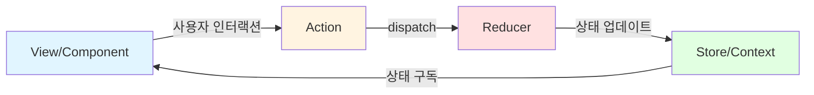
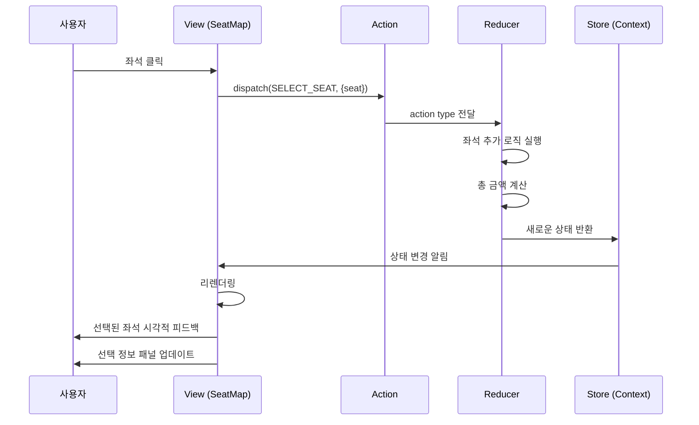
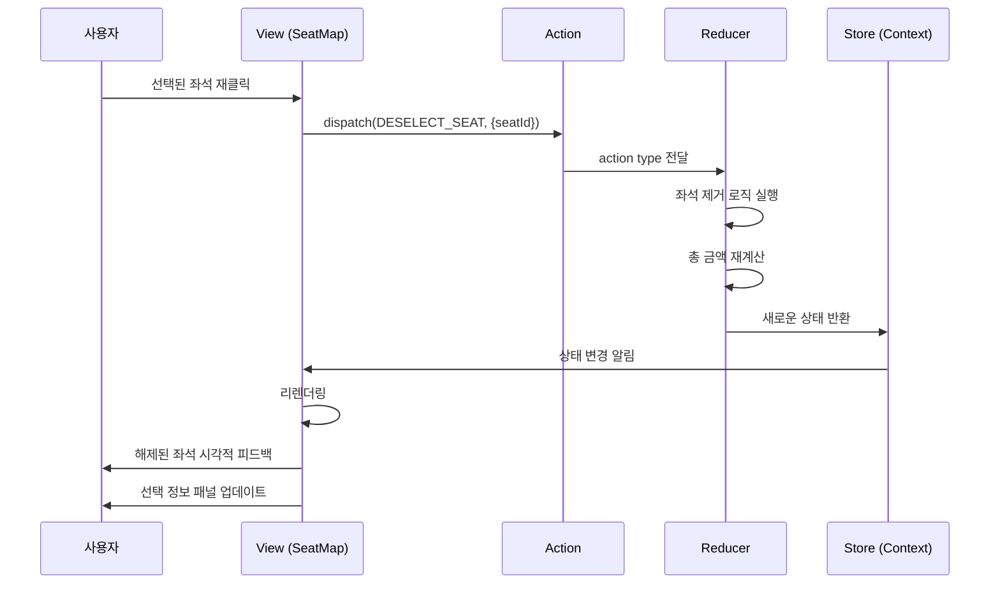
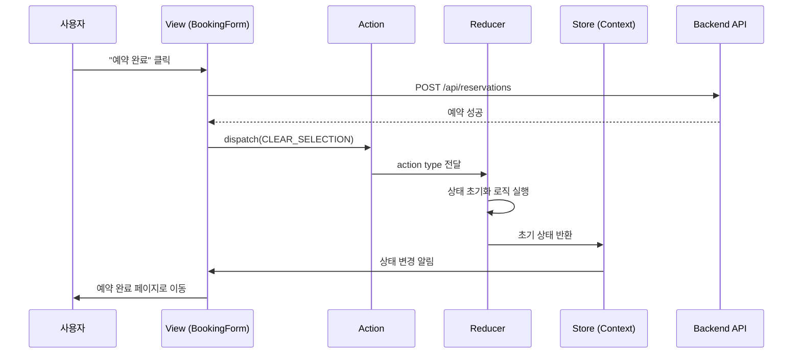
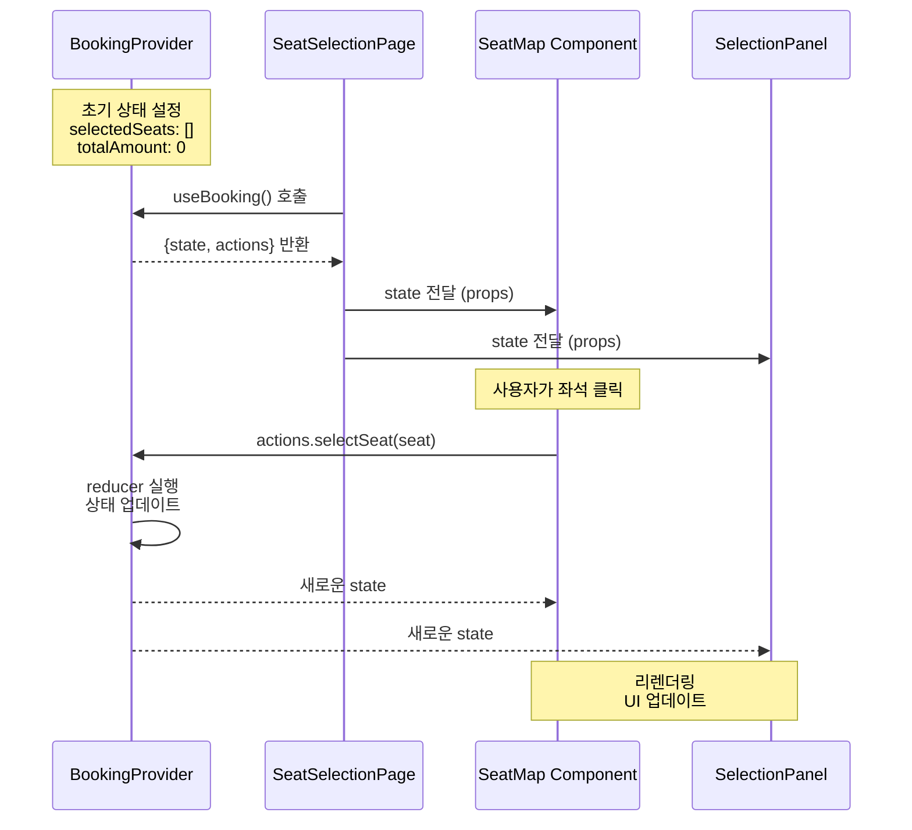
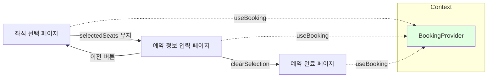

# State Management Design: 콘서트 예약 웹앱

## 개요

본 문서는 콘서트 예약 시스템의 상태 관리 설계를 정의합니다. Flux 아키텍처 패턴을 적용하고, React Context + useReducer를 사용하여 비즈니스 로직을 중앙화 관리합니다.

---

## 1. 상태 데이터 분류

### 1.1 관리해야 할 상태 (전역 상태 - Context)

| 상태명 | 타입 | 설명 | 초기값 |
|--------|------|------|--------|
| `selectedConcertId` | `string \| null` | 현재 선택된 콘서트 ID | `null` |
| `selectedSeats` | `Seat[]` | 사용자가 선택한 좌석 배열 | `[]` |
| `totalAmount` | `number` | 선택된 좌석의 총 금액 | `0` |

**상태로 관리하는 이유:**
- 좌석 선택 페이지 → 예약 정보 입력 페이지 → 예약 완료 페이지 간 데이터 공유 필요
- 사용자가 뒤로가기 시 선택 상태 복원 필요
- 여러 컴포넌트에서 동일한 데이터에 접근 필요

### 1.2 상태가 아닌 데이터

#### 서버 상태 (React Query로 관리)
| 데이터명 | 설명 | 관리 방법 |
|---------|------|----------|
| 콘서트 목록 | 예약 가능한 콘서트 리스트 | `useQuery(['concerts'])` |
| 콘서트 상세 정보 | 특정 콘서트의 상세 정보 | `useQuery(['concert', id])` |
| 좌석 현황 | 콘서트별 좌석 배치 및 상태 | `useQuery(['seats', concertId])` |
| 좌석 등급 정보 | 등급별 가격 및 범위 | 콘서트 상세 정보에 포함 |
| 예약 정보 | 예약 조회 결과 | `useQuery(['reservation', phone, password])` |

**서버 상태로 관리하는 이유:**
- DB에서 조회한 읽기 전용 데이터
- 캐싱, 자동 리패칭, 로딩 상태 관리 등 React Query의 기능 활용
- 서버와의 동기화 필요

#### 로컬 상태 (useState로 관리)
| 데이터명 | 설명 | 관리 위치 |
|---------|------|----------|
| 폼 입력 값 | 예약자명, 휴대폰번호, 비밀번호 | 각 폼 컴포넌트 |
| 유효성 검증 에러 | 필드별 에러 메시지 | 각 폼 컴포넌트 |
| UI 상태 | 모달 열림/닫힘, 툴팁 표시 등 | 해당 컴포넌트 |
| 로딩 상태 | API 요청 중 로딩 표시 | React Query 자동 관리 |

**로컬 상태로 관리하는 이유:**
- 특정 컴포넌트 내에서만 사용
- 다른 페이지로 이동 시 초기화되어도 무방
- 간단한 UI 제어

---

## 2. 상태 변경 조건 및 화면 변화

### 2.1 selectedConcertId

| 변경 조건 | 액션 | 화면 변화 |
|----------|------|----------|
| 콘서트 상세 페이지 진입 | `SET_CONCERT` | - 콘서트 ID 저장<br>- 이후 좌석 선택 시 해당 콘서트의 좌석 조회 |
| 예약 완료 또는 페이지 이탈 | `CLEAR_SELECTION` | - null로 초기화 |

### 2.2 selectedSeats

| 변경 조건 | 액션 | 화면 변화 |
|----------|------|----------|
| 좌석 클릭 (예약 가능) | `SELECT_SEAT` | - 좌석 배열에 추가<br>- 좌석 시각적으로 "선택됨" 상태 표시<br>- 선택 정보 패널에 좌석 목록 추가<br>- 총 금액 자동 계산 및 업데이트<br>- "예약하기" 버튼 활성화 |
| 선택된 좌석 재클릭 | `DESELECT_SEAT` | - 좌석 배열에서 제거<br>- 좌석 시각적으로 "예약 가능" 상태로 복원<br>- 선택 정보 패널에서 좌석 제거<br>- 총 금액 재계산 및 업데이트<br>- 배열이 비면 "예약하기" 버튼 비활성화 |
| 예약 완료 | `CLEAR_SELECTION` | - 빈 배열로 초기화<br>- 선택 정보 패널 초기화 |
| 좌석 선택 → 예약 정보 입력 | (변경 없음) | - 상태 유지<br>- 예약 정보 입력 페이지에 좌석 요약 표시 |
| 예약 정보 입력 → 좌석 선택 (이전 버튼) | (변경 없음) | - 상태 유지<br>- 이전 선택 상태 복원 |

### 2.3 totalAmount

| 변경 조건 | 액션 | 화면 변화 |
|----------|------|----------|
| 좌석 선택 시 | `SELECT_SEAT` | - 선택된 좌석의 가격을 기존 총액에 더함<br>- 선택 정보 패널에 업데이트된 총 금액 표시 |
| 좌석 해제 시 | `DESELECT_SEAT` | - 해제된 좌석의 가격을 총액에서 뺌<br>- 선택 정보 패널에 업데이트된 총 금액 표시 |
| 예약 완료 | `CLEAR_SELECTION` | - 0으로 초기화 |

---

## 3. Flux 패턴 시각화

### 3.1 전체 Flux 흐름



### 3.2 좌석 선택 플로우



### 3.3 좌석 해제 플로우



### 3.4 예약 완료 플로우



---

## 4. Context + useReducer 설계

### 4.1 BookingContext 구조

```typescript
// 상태 타입 정의
interface Seat {
  id: string;
  section: 'A' | 'B' | 'C' | 'D';
  row: number;
  column: number;
  grade: 'SPECIAL' | 'PREMIUM' | 'ADVANCED' | 'REGULAR';
  price: number;
}

interface BookingState {
  selectedConcertId: string | null;
  selectedSeats: Seat[];
  totalAmount: number;
}

// 액션 타입 정의
type BookingAction =
  | { type: 'SET_CONCERT'; payload: { concertId: string } }
  | { type: 'SELECT_SEAT'; payload: { seat: Seat } }
  | { type: 'DESELECT_SEAT'; payload: { seatId: string } }
  | { type: 'CLEAR_SELECTION' };

// Context 값 타입
interface BookingContextValue {
  state: BookingState;
  actions: {
    setConcert: (concertId: string) => void;
    selectSeat: (seat: Seat) => void;
    deselectSeat: (seatId: string) => void;
    clearSelection: () => void;
  };
}
```

### 4.2 Reducer 로직

```typescript
function bookingReducer(state: BookingState, action: BookingAction): BookingState {
  switch (action.type) {
    case 'SET_CONCERT':
      return {
        ...state,
        selectedConcertId: action.payload.concertId,
      };

    case 'SELECT_SEAT': {
      const { seat } = action.payload;
      
      // 중복 선택 방지
      if (state.selectedSeats.some(s => s.id === seat.id)) {
        return state;
      }

      const newSeats = [...state.selectedSeats, seat];
      const newTotal = newSeats.reduce((sum, s) => sum + s.price, 0);

      return {
        ...state,
        selectedSeats: newSeats,
        totalAmount: newTotal,
      };
    }

    case 'DESELECT_SEAT': {
      const { seatId } = action.payload;
      const newSeats = state.selectedSeats.filter(s => s.id !== seatId);
      const newTotal = newSeats.reduce((sum, s) => sum + s.price, 0);

      return {
        ...state,
        selectedSeats: newSeats,
        totalAmount: newTotal,
      };
    }

    case 'CLEAR_SELECTION':
      return {
        selectedConcertId: null,
        selectedSeats: [],
        totalAmount: 0,
      };

    default:
      return state;
  }
}
```

### 4.3 Context Provider 구조

```typescript
const BookingContext = createContext<BookingContextValue | undefined>(undefined);

function BookingProvider({ children }: { children: ReactNode }) {
  const initialState: BookingState = {
    selectedConcertId: null,
    selectedSeats: [],
    totalAmount: 0,
  };

  const [state, dispatch] = useReducer(bookingReducer, initialState);

  // 액션 함수들
  const actions = useMemo(
    () => ({
      setConcert: (concertId: string) => {
        dispatch({ type: 'SET_CONCERT', payload: { concertId } });
      },
      selectSeat: (seat: Seat) => {
        dispatch({ type: 'SELECT_SEAT', payload: { seat } });
      },
      deselectSeat: (seatId: string) => {
        dispatch({ type: 'DESELECT_SEAT', payload: { seatId } });
      },
      clearSelection: () => {
        dispatch({ type: 'CLEAR_SELECTION' });
      },
    }),
    []
  );

  const value = useMemo(() => ({ state, actions }), [state, actions]);

  return (
    <BookingContext.Provider value={value}>
      {children}
    </BookingContext.Provider>
  );
}
```

### 4.4 Custom Hook

```typescript
function useBooking() {
  const context = useContext(BookingContext);
  
  if (!context) {
    throw new Error('useBooking must be used within BookingProvider');
  }
  
  return context;
}
```

---

## 5. Context 데이터 흐름 시각화

### 5.1 전체 구조

```mermaid
graph TB
    subgraph "App Root"
        A[BookingProvider]
    end
    
    subgraph "Pages"
        B[ConcertDetailPage]
        C[SeatSelectionPage]
        D[BookingFormPage]
        E[ConfirmationPage]
    end
    
    subgraph "Components"
        F[SeatMap]
        G[SeatCard]
        H[SelectionPanel]
        I[BookingForm]
    end
    
    A -->|Context 제공| B
    A -->|Context 제공| C
    A -->|Context 제공| D
    A -->|Context 제공| E
    
    C -->|포함| F
    F -->|포함| G
    C -->|포함| H
    D -->|포함| I
    
    G -->|useBooking()| A
    H -->|useBooking()| A
    I -->|useBooking()| A
    
    style A fill:#e1ffe1
    style B fill:#e1f5ff
    style C fill:#e1f5ff
    style D fill:#e1f5ff
    style E fill:#e1f5ff
```

### 5.2 데이터 흐름 상세



### 5.3 페이지 간 상태 공유



---

## 6. 하위 컴포넌트 노출 인터페이스

### 6.1 상태 (State)

컴포넌트에서 `useBooking().state`로 접근 가능:

| 변수명 | 타입 | 설명 | 사용 위치 |
|--------|------|------|----------|
| `selectedConcertId` | `string \| null` | 선택된 콘서트 ID | 좌석 선택 페이지 |
| `selectedSeats` | `Seat[]` | 선택된 좌석 배열 | 좌석 선택, 예약 정보 입력 |
| `totalAmount` | `number` | 총 금액 | 좌석 선택, 예약 정보 입력 |

### 6.2 액션 함수 (Actions)

컴포넌트에서 `useBooking().actions`로 접근 가능:

| 함수명 | 시그니처 | 설명 | 사용 위치 |
|--------|---------|------|----------|
| `setConcert` | `(concertId: string) => void` | 콘서트 선택 | 콘서트 상세 페이지 |
| `selectSeat` | `(seat: Seat) => void` | 좌석 선택 | SeatCard 컴포넌트 |
| `deselectSeat` | `(seatId: string) => void` | 좌석 선택 해제 | SeatCard 컴포넌트 |
| `clearSelection` | `() => void` | 모든 선택 초기화 | 예약 완료 후 |

### 6.3 파생 값 (Derived Values)

컴포넌트에서 계산하여 사용:

| 값 | 계산 방법 | 설명 | 사용 위치 |
|----|----------|------|----------|
| `isAnySelected` | `selectedSeats.length > 0` | 좌석 선택 여부 | "예약하기" 버튼 활성화 |
| `selectedCount` | `selectedSeats.length` | 선택된 좌석 수 | 선택 정보 패널 |
| `formattedAmount` | `totalAmount.toLocaleString()` | 포맷된 금액 | 선택 정보 패널 |
| `isSeatSelected` | `(seatId) => selectedSeats.some(s => s.id === seatId)` | 특정 좌석 선택 여부 | SeatCard 스타일링 |

### 6.4 사용 예시

```typescript
// SeatCard 컴포넌트
function SeatCard({ seat, status }) {
  const { state, actions } = useBooking();
  
  const isSelected = state.selectedSeats.some(s => s.id === seat.id);
  const isReserved = status === 'RESERVED';
  
  const handleClick = () => {
    if (isReserved) return;
    
    if (isSelected) {
      actions.deselectSeat(seat.id);
    } else {
      actions.selectSeat(seat);
    }
  };
  
  return (
    <button 
      onClick={handleClick}
      className={cn(
        'seat-card',
        isSelected && 'selected',
        isReserved && 'reserved'
      )}
    >
      {seat.column}
    </button>
  );
}

// SelectionPanel 컴포넌트
function SelectionPanel() {
  const { state } = useBooking();
  
  return (
    <div className="selection-panel">
      <h3>선택한 좌석 ({state.selectedSeats.length}석)</h3>
      <ul>
        {state.selectedSeats.map(seat => (
          <li key={seat.id}>
            {seat.section}구역 {seat.row}행 {seat.column}열
          </li>
        ))}
      </ul>
      <div className="total">
        총 금액: {state.totalAmount.toLocaleString()}원
      </div>
    </div>
  );
}

// BookingForm 컴포넌트
function BookingForm() {
  const { state, actions } = useBooking();
  
  const handleSubmit = async (formData) => {
    try {
      await submitReservation({
        seats: state.selectedSeats,
        totalAmount: state.totalAmount,
        ...formData,
      });
      
      actions.clearSelection();
      // 예약 완료 페이지로 이동
    } catch (error) {
      // 에러 처리
    }
  };
  
  return (
    <form onSubmit={handleSubmit}>
      {/* 폼 필드들 */}
    </form>
  );
}
```

---

## 7. 상태 관리 베스트 프랙티스

### 7.1 불변성 유지

```typescript
// ✅ Good: 새로운 배열/객체 생성
case 'SELECT_SEAT':
  return {
    ...state,
    selectedSeats: [...state.selectedSeats, action.payload.seat],
  };

// ❌ Bad: 기존 배열 직접 수정
case 'SELECT_SEAT':
  state.selectedSeats.push(action.payload.seat);
  return state;
```

### 7.2 액션 타입 상수화

```typescript
// constants/booking-actions.ts
export const BOOKING_ACTIONS = {
  SET_CONCERT: 'SET_CONCERT',
  SELECT_SEAT: 'SELECT_SEAT',
  DESELECT_SEAT: 'DESELECT_SEAT',
  CLEAR_SELECTION: 'CLEAR_SELECTION',
} as const;

// reducer에서 사용
case BOOKING_ACTIONS.SELECT_SEAT:
  // ...
```

### 7.3 성능 최적화

```typescript
// useMemo로 액션 함수 메모이제이션
const actions = useMemo(
  () => ({
    selectSeat: (seat: Seat) => {
      dispatch({ type: 'SELECT_SEAT', payload: { seat } });
    },
    // ...
  }),
  [] // 의존성 배열 비어있음
);

// Context value 메모이제이션
const value = useMemo(
  () => ({ state, actions }),
  [state, actions]
);
```

### 7.4 타입 안전성

```typescript
// 모든 액션 타입을 Union Type으로 정의
type BookingAction =
  | { type: 'SET_CONCERT'; payload: { concertId: string } }
  | { type: 'SELECT_SEAT'; payload: { seat: Seat } }
  | { type: 'DESELECT_SEAT'; payload: { seatId: string } }
  | { type: 'CLEAR_SELECTION' };

// Reducer에서 exhaustive check
function bookingReducer(state: BookingState, action: BookingAction): BookingState {
  switch (action.type) {
    case 'SET_CONCERT':
      // ...
    case 'SELECT_SEAT':
      // ...
    case 'DESELECT_SEAT':
      // ...
    case 'CLEAR_SELECTION':
      // ...
    default:
      // TypeScript가 모든 케이스를 처리했는지 확인
      const _exhaustiveCheck: never = action;
      return state;
  }
}
```

---

## 8. 테스트 전략

### 8.1 Reducer 테스트

```typescript
describe('bookingReducer', () => {
  it('should add seat to selectedSeats', () => {
    const initialState = {
      selectedConcertId: null,
      selectedSeats: [],
      totalAmount: 0,
    };
    
    const seat = {
      id: 'seat-1',
      section: 'A',
      row: 1,
      column: 1,
      grade: 'SPECIAL',
      price: 250000,
    };
    
    const action = { type: 'SELECT_SEAT', payload: { seat } };
    const newState = bookingReducer(initialState, action);
    
    expect(newState.selectedSeats).toHaveLength(1);
    expect(newState.totalAmount).toBe(250000);
  });
});
```

### 8.2 Context 통합 테스트

```typescript
describe('BookingProvider', () => {
  it('should provide booking context to children', () => {
    const { result } = renderHook(() => useBooking(), {
      wrapper: BookingProvider,
    });
    
    expect(result.current.state.selectedSeats).toEqual([]);
    
    act(() => {
      result.current.actions.selectSeat(mockSeat);
    });
    
    expect(result.current.state.selectedSeats).toHaveLength(1);
  });
});
```

---

**문서 버전**: 1.0  
**작성일**: 2025-10-15  
**최종 수정일**: 2025-10-15

