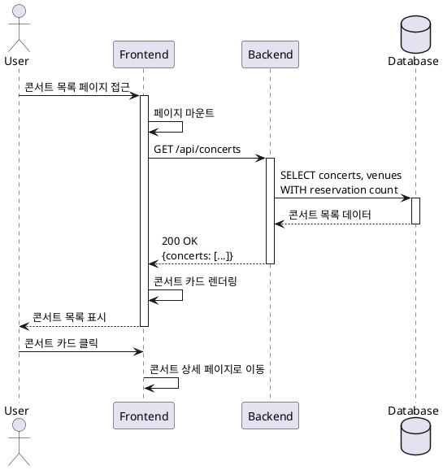

# UC-001: 콘서트 목록 조회

## Primary Actor
사용자 (User)

## Precondition
- 사용자가 웹 브라우저를 통해 콘서트 예약 시스템에 접속 가능

## Trigger
사용자가 콘서트 목록 페이지(`/concerts`)에 접근

## Main Scenario

1. 사용자가 콘서트 목록 페이지에 접근
2. 시스템이 예약 가능한 콘서트 목록을 조회하여 표시
3. 각 콘서트 카드에 다음 정보 표시:
   - 공연 포스터 이미지
   - 공연명
   - 날짜 및 시간
   - 공연 장소
   - 예약 현황 (현재 예약 인원/총 좌석 수)
4. 사용자가 원하는 콘서트 카드를 선택하여 상세 페이지로 이동

## Edge Cases

### EC-1: 콘서트 목록이 비어있을 때
- 시스템은 "현재 예약 가능한 콘서트가 없습니다" 안내 메시지를 표시

### EC-2: 이미지 로드 실패
- 시스템은 기본 placeholder 이미지를 표시

### EC-3: API 응답 지연 (3초 이상)
- 시스템은 로딩 스피너를 표시하고, 타임아웃 시 에러 메시지와 재시도 버튼 제공

### EC-4: 예약 마감된 콘서트
- 시스템은 카드에 "매진" 표시를 하고 클릭 불가능한 상태로 표시

### EC-5: 네트워크 오류
- 시스템은 에러 메시지와 재시도 버튼을 표시

## Business Rules

- BR-1: 콘서트 목록은 공연 날짜 순으로 정렬되어 표시
- BR-2: 총 좌석 수는 공연장 구성에 따라 계산 (4구역 × 4행 × 20열 = 320석)
- BR-3: 예약 현황은 실시간으로 계산되어 표시
- BR-4: 과거 날짜의 콘서트는 목록에서 제외

## Sequence Diagram

