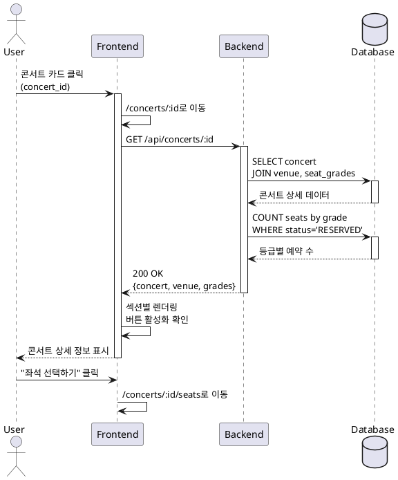

# UC-002: 콘서트 상세 조회

## Primary Actor
사용자 (User)

## Precondition
- 사용자가 콘서트 목록 페이지에서 콘서트를 확인한 상태

## Trigger
사용자가 콘서트 카드를 클릭하거나 콘서트 상세 페이지 URL에 직접 접근

## Main Scenario

1. 사용자가 특정 콘서트의 상세 페이지(`/concerts/:id`)에 접근
2. 시스템이 콘서트 ID로 상세 정보를 조회
3. 다음 정보를 섹션별로 표시:
   - **콘서트 정보**: 공연명, 일시, 공연장명, 상세 설명, 포스터
   - **공연장 정보**: 주소, 좌석 구성 (4구역, 각 4행×20열)
   - **좌석 등급 정보**: Special, Premium, Advanced, Regular의 가격 및 잔여석
4. 시스템이 잔여석 확인 후 "좌석 선택하기" 버튼 활성화 상태 결정
5. 사용자가 "좌석 선택하기" 버튼을 클릭하여 좌석 선택 페이지로 이동

## Edge Cases

### EC-1: 존재하지 않는 콘서트 ID
- 시스템은 404 페이지를 표시하고 콘서트 목록으로 이동 버튼 제공

### EC-2: 콘서트 매진
- 시스템은 "좌석 선택하기" 버튼을 비활성화하고 매진 안내 표시

### EC-3: 과거 콘서트
- 시스템은 예약 불가 안내 메시지를 표시하고 버튼 비활성화

### EC-4: 포스터 이미지 로드 실패
- 시스템은 기본 placeholder 이미지를 표시

### EC-5: 네트워크 오류
- 시스템은 에러 메시지와 재시도 버튼을 표시

## Business Rules

- BR-1: 좌석 등급은 4개로 고정 (Special: 250,000원, Premium: 190,000원, Advanced: 170,000원, Regular: 140,000원)
- BR-2: 잔여석이 0석이면 "좌석 선택하기" 버튼 비활성화
- BR-3: 콘서트 일시가 현재 시간보다 과거면 예약 불가 처리
- BR-4: 좌석 등급별 잔여석은 실시간으로 계산되어 표시

## Sequence Diagram

