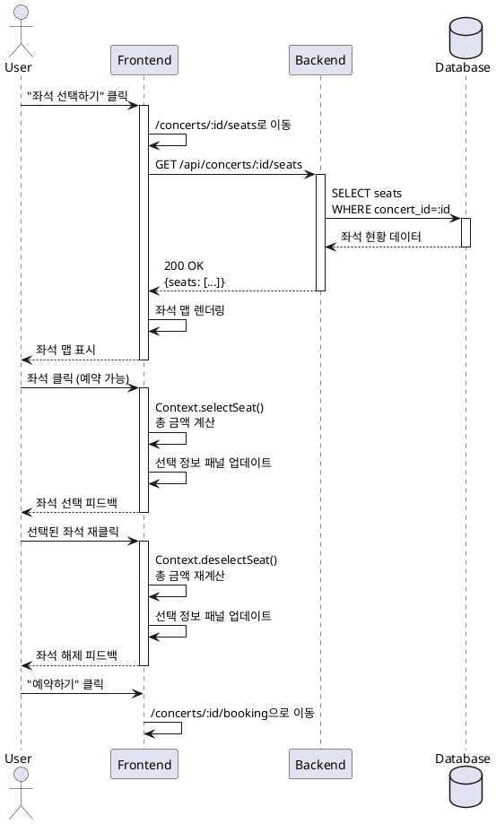

# UC-003: 좌석 선택

## Primary Actor
사용자 (User)

## Precondition
- 사용자가 콘서트 상세 페이지에서 예약 가능한 콘서트를 확인한 상태
- 콘서트에 잔여석이 존재

## Trigger
사용자가 콘서트 상세 페이지에서 "좌석 선택하기" 버튼 클릭

## Main Scenario

1. 사용자가 좌석 선택 페이지(`/concerts/:id/seats`)에 접근
2. 시스템이 좌석 현황을 조회하여 좌석 맵 표시:
   - 4개 구역 (A, B, C, D) 시각화
   - 각 구역: 4행 × 20열 배치
   - 좌석 등급별 색상 구분 (Special, Premium, Advanced, Regular)
   - 상태별 스타일 (예약 가능/예약됨)
3. 사용자가 원하는 좌석을 클릭하여 선택
4. 시스템이 Context에 선택된 좌석 저장 및 총 금액 계산
5. 선택 정보 패널에 실시간 업데이트:
   - 선택된 좌석 목록 (구역-행-열)
   - 총 금액
6. 사용자가 좌석 선택 완료 후 "예약하기" 버튼 클릭

## Edge Cases

### EC-1: 좌석 미선택 상태에서 예약하기 클릭
- 시스템은 "예약하기" 버튼을 비활성화 상태로 유지

### EC-2: 다른 사용자가 먼저 예약한 좌석 클릭
- 시스템은 좌석 상태를 실시간 동기화하고 "예약됨" 상태로 표시, 선택 불가 안내

### EC-3: 선택된 좌석 재클릭 (선택 해제)
- 시스템은 해당 좌석을 선택 해제하고 Context에서 제거, 총 금액 재계산

### EC-4: 예약된 좌석 클릭
- 시스템은 클릭을 무시하고 "이미 예약된 좌석입니다" 툴팁 표시

### EC-5: 좌석 데이터 로드 실패
- 시스템은 에러 메시지와 이전 페이지로 돌아가기 버튼 제공

### EC-6: 페이지 이탈 시
- Context에 선택 상태 유지 (새로고침 시에는 초기화)

## Business Rules

- BR-1: 좌석 등급은 열 번호에 따라 자동 결정 (1~3: Special, 4~7: Premium, 8~15: Advanced, 16~20: Regular)
- BR-2: 최소 1석 이상 선택 시 "예약하기" 버튼 활성화
- BR-3: 총 금액은 선택된 좌석 등급의 가격 합계로 자동 계산
- BR-4: 예약된 좌석(status='RESERVED')은 선택 불가
- BR-5: 선택한 좌석 정보는 Context Store에 저장

## Sequence Diagram

