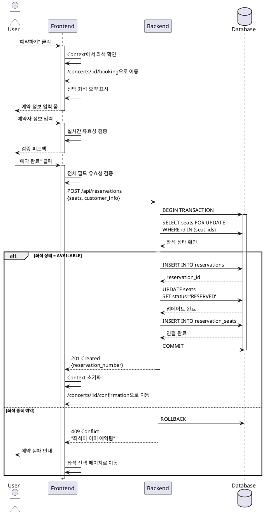

# UC-004: 예약 정보 입력

## Primary Actor
사용자 (User)

## Precondition
- 사용자가 좌석 선택 페이지에서 최소 1석 이상 선택한 상태
- Context에 선택된 좌석 정보가 저장되어 있음

## Trigger
사용자가 좌석 선택 페이지에서 "예약하기" 버튼 클릭

## Main Scenario

1. 사용자가 예약 정보 입력 페이지(`/concerts/:id/booking`)에 접근
2. 시스템이 선택된 좌석 요약 정보 표시:
   - 선택한 좌석 수
   - 선택한 좌석 내역 (구역-행-열)
   - 총 금액
3. 사용자가 예약자 정보 입력:
   - 예약자명 (2~20자)
   - 휴대폰번호 (10~11자리 숫자)
   - 비밀번호 (4자리 숫자)
4. 시스템이 각 필드의 실시간 유효성 검증 수행
5. 사용자가 "예약 완료" 버튼 클릭
6. 시스템이 예약 생성 처리:
   - 좌석 예약 가능 여부 재확인
   - 예약 레코드 생성
   - 좌석 상태를 RESERVED로 변경
   - 예약 번호 생성
7. 예약 완료 페이지로 이동

## Edge Cases

### EC-1: 필수 필드 미입력
- 시스템은 "예약 완료" 버튼을 비활성화하고 필드별 에러 메시지 표시

### EC-2: 휴대폰번호에 하이픈 포함 입력
- 시스템은 자동으로 하이픈을 제거하고 유효성 검증

### EC-3: 비밀번호에 숫자 외 문자 입력
- 시스템은 숫자만 입력 가능하도록 입력 차단

### EC-4: 예약 처리 중 동일 좌석 중복 예약 발생
- 시스템은 트랜잭션 롤백, 예약 실패 안내 후 좌석 선택 페이지로 이동

### EC-5: Context에 선택된 좌석이 없는 경우
- 시스템은 좌석 선택 페이지로 리다이렉트

### EC-6: 예약 API 타임아웃
- 시스템은 타임아웃 에러 메시지와 재시도 버튼 제공

### EC-7: "이전" 버튼 클릭
- Context 상태를 유지하며 좌석 선택 페이지로 이동

## Business Rules

- BR-1: 예약자명은 2자 이상 20자 이하
- BR-2: 휴대폰번호는 01로 시작하는 10~11자리 숫자
- BR-3: 비밀번호는 숫자 4자리 (예약 조회 시 사용)
- BR-4: 예약 생성은 트랜잭션으로 처리 (좌석 상태 확인 → 예약 생성 → 좌석 상태 변경)
- BR-5: 예약 번호는 시스템에서 자동 생성되는 고유값
- BR-6: 비밀번호는 해시화하여 저장

## Sequence Diagram

