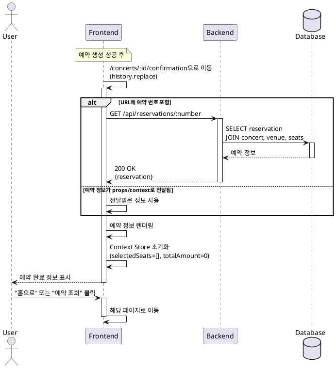

# UC-005: 예약 완료 확인

## Primary Actor
사용자 (User)

## Precondition
- 사용자가 예약 정보 입력 페이지에서 예약을 성공적으로 완료한 상태
- 예약 번호가 생성되어 전달됨

## Trigger
예약 생성 API가 성공 응답을 반환

## Main Scenario

1. 시스템이 예약 완료 페이지(`/concerts/:id/confirmation`)로 이동
2. 예약 완료 정보 표시:
   - 예약 완료 메시지
   - 예약 번호
   - 콘서트 정보 (공연명, 일시, 공연장)
   - 예약된 좌석 정보 (구역-행-열 목록)
   - 예약자 정보 (이름, 휴대폰번호)
   - 총 결제 금액
3. 시스템이 Context Store 초기화 (selectedSeats 배열, totalAmount 리셋)
4. 네비게이션 버튼 제공:
   - "홈으로" 버튼
   - "예약 조회" 버튼
5. 사용자가 원하는 버튼을 클릭하여 다음 페이지로 이동

## Edge Cases

### EC-1: 예약 정보 없이 직접 URL 접근
- 시스템은 콘서트 목록 페이지로 리다이렉트

### EC-2: 페이지 새로고침
- URL에 예약 번호가 있으면 API로 예약 정보 재조회
- 예약 번호가 없으면 홈으로 이동

### EC-3: 브라우저 뒤로가기 클릭
- 히스토리 관리(replace)로 예약 정보 입력 페이지로 이동 방지

### EC-4: 예약 정보 조회 실패
- 시스템은 "예약 정보를 찾을 수 없습니다" 메시지와 홈으로 버튼 제공

## Business Rules

- BR-1: 예약 완료 후 Context Store는 즉시 초기화
- BR-2: 예약 번호는 고유하며 예약 조회 시 사용 가능
- BR-3: 예약 완료 페이지는 히스토리 replace로 처리하여 뒤로가기 방지
- BR-4: 예약 정보는 DB에 영구 저장되어 언제든 조회 가능

## Sequence Diagram

