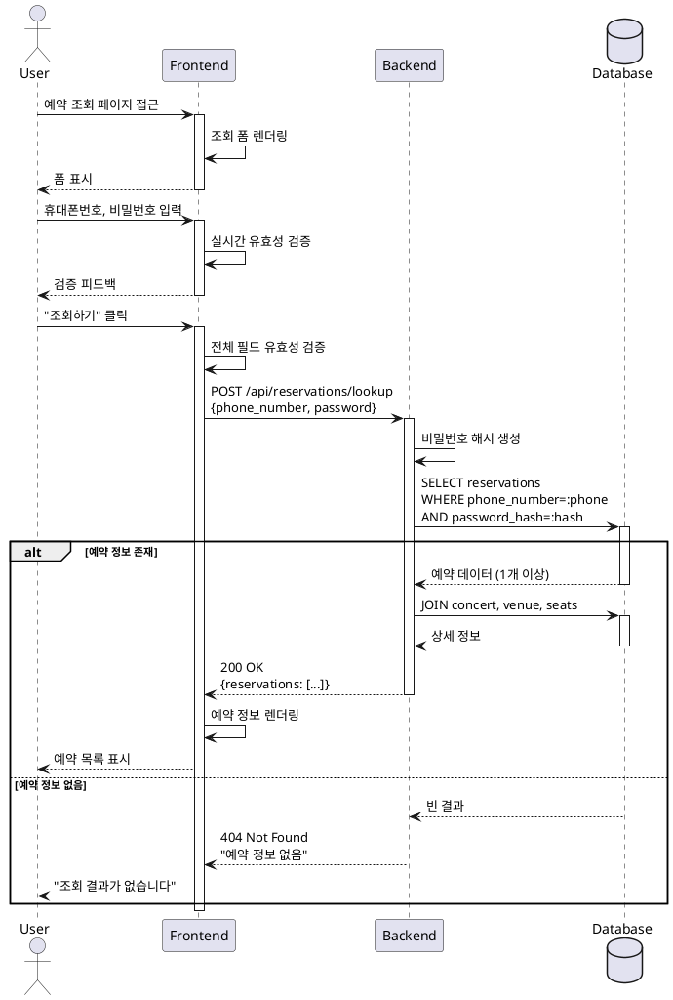

# UC-006: 예약 조회

## Primary Actor
사용자 (User)

## Precondition
- 사용자가 이전에 예약을 완료한 상태
- 예약 시 입력한 휴대폰번호와 비밀번호를 기억하고 있음

## Trigger
사용자가 예약 조회 페이지(`/reservations`)에 접근

## Main Scenario

1. 사용자가 예약 조회 페이지에 접근
2. 시스템이 조회 폼 표시:
   - 휴대폰번호 입력 필드
   - 비밀번호 입력 필드 (4자리)
3. 사용자가 휴대폰번호와 비밀번호 입력
4. 시스템이 실시간 유효성 검증 수행
5. 사용자가 "조회하기" 버튼 클릭
6. 시스템이 예약 정보 조회:
   - 휴대폰번호와 비밀번호로 예약 검색
   - 비밀번호 해시 비교
7. 조회 결과 표시:
   - 예약 번호
   - 콘서트 정보 (공연명, 일시, 공연장)
   - 예약된 좌석 정보 (구역-행-열)
   - 예약자 정보 (이름, 휴대폰번호)
   - 예약 일시
   - 총 결제 금액

## Edge Cases

### EC-1: 필수 필드 미입력
- 시스템은 "조회하기" 버튼을 비활성화

### EC-2: 존재하지 않는 휴대폰번호 입력
- 시스템은 "조회 결과가 없습니다" 안내 메시지 표시

### EC-3: 비밀번호 불일치
- 시스템은 "예약 정보를 찾을 수 없습니다" 메시지 표시 (보안상 구체적 정보 노출 최소화)

### EC-4: 여러 개의 예약이 있는 경우
- 시스템은 모든 예약 목록을 최신순으로 정렬하여 표시

### EC-5: 취소된 예약 조회
- 시스템은 예약 상태를 "취소됨"으로 표시하고 취소 일시 표시

### EC-6: 과거 콘서트 예약 조회
- 시스템은 정상 표시하고 "종료된 공연" 표시 추가

### EC-7: 네트워크 오류
- 시스템은 에러 메시지와 재시도 버튼 제공

## Business Rules

- BR-1: 휴대폰번호는 10~11자리 숫자
- BR-2: 비밀번호는 숫자 4자리
- BR-3: 비밀번호는 해시 비교로 검증
- BR-4: 조회 실패 시 구체적인 실패 원인을 노출하지 않음 (보안)
- BR-5: 동일 휴대폰번호로 여러 예약이 있을 경우 모두 표시
- BR-6: 예약 목록은 최신순 정렬

## Sequence Diagram

