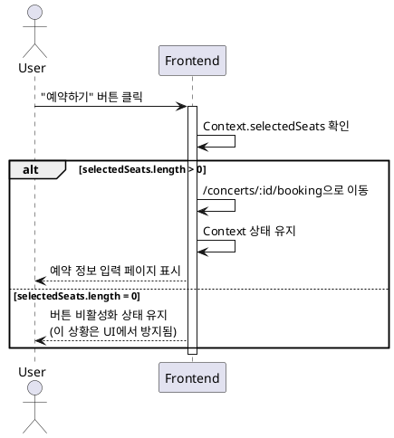

# UC-007: 좌석 선택에서 예약 정보 입력으로 이동

## Primary Actor
사용자 (User)

## Precondition
- 사용자가 좌석 선택 페이지에 있음
- 최소 1석 이상 선택한 상태

## Trigger
사용자가 좌석 선택 페이지에서 "예약하기" 버튼 클릭

## Main Scenario

1. 사용자가 "예약하기" 버튼 클릭
2. 시스템이 Context에서 선택된 좌석 확인
3. 선택된 좌석이 있음을 검증
4. 시스템이 예약 정보 입력 페이지(`/concerts/:id/booking`)로 이동
5. Context 상태 유지 (선택된 좌석 정보 보존)

## Edge Cases

### EC-1: 선택한 좌석이 없는 상태에서 버튼 클릭
- 시스템은 "예약하기" 버튼을 비활성화 상태로 유지

### EC-2: Context 상태가 초기화된 경우
- 시스템은 좌석 선택 페이지로 리다이렉트하고 "좌석을 선택해주세요" 안내 표시

### EC-3: 네비게이션 중 오류 발생
- 시스템은 현재 페이지에 머물고 에러 메시지 표시

## Business Rules

- BR-1: "예약하기" 버튼은 최소 1석 이상 선택 시에만 활성화
- BR-2: Context에 저장된 좌석 정보는 페이지 이동 시 유지
- BR-3: 선택된 좌석 정보는 다음 페이지에서 사용

## Sequence Diagram

