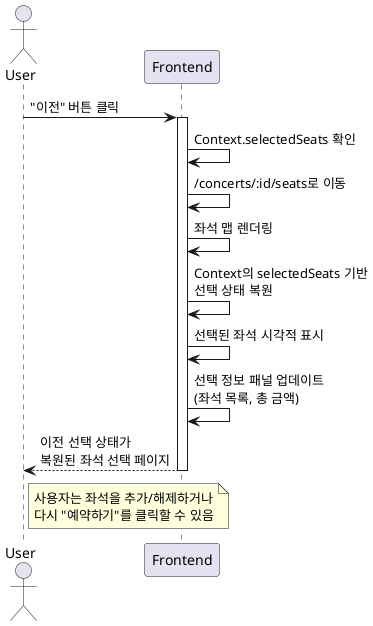

# UC-008: 예약 정보 입력에서 좌석 선택으로 돌아가기

## Primary Actor
사용자 (User)

## Precondition
- 사용자가 예약 정보 입력 페이지에 있음
- Context에 선택된 좌석 정보가 저장되어 있음

## Trigger
사용자가 예약 정보 입력 페이지에서 "이전" 버튼 클릭

## Main Scenario

1. 사용자가 "이전" 버튼 클릭
2. 시스템이 Context 상태 확인 (선택된 좌석 정보 유지)
3. 시스템이 좌석 선택 페이지(`/concerts/:id/seats`)로 이동
4. 이전에 선택했던 좌석 상태 복원:
   - Context의 selectedSeats 배열 기반으로 UI 렌더링
   - 선택된 좌석 시각적으로 표시
   - 선택 정보 패널 업데이트 (좌석 목록, 총 금액)

## Edge Cases

### EC-1: 입력 중인 데이터가 있는 경우
- 시스템은 데이터 손실 경고 없이 이동 (Context의 좌석 선택 상태는 유지)

### EC-2: Context에 선택된 좌석이 없는 경우
- 시스템은 빈 상태로 좌석 선택 페이지 표시

### EC-3: 네비게이션 중 오류 발생
- 시스템은 현재 페이지에 머물고 에러 메시지 표시

## Business Rules

- BR-1: Context 상태는 페이지 이동 시 유지
- BR-2: 입력한 예약자 정보는 저장되지 않음 (좌석 정보만 유지)
- BR-3: 좌석 선택 페이지로 돌아가도 이전 선택 상태가 복원됨
- BR-4: 사용자는 좌석을 추가 선택하거나 해제할 수 있음

## Sequence Diagram

